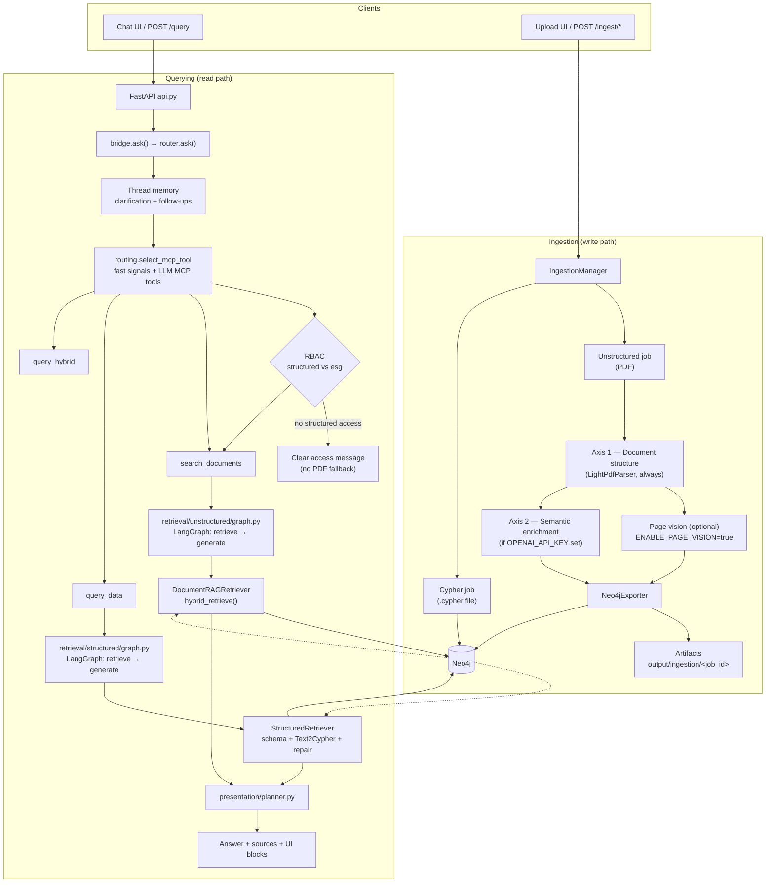
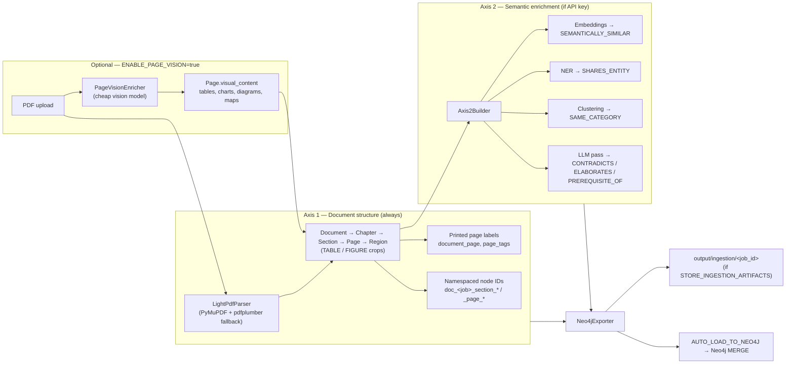
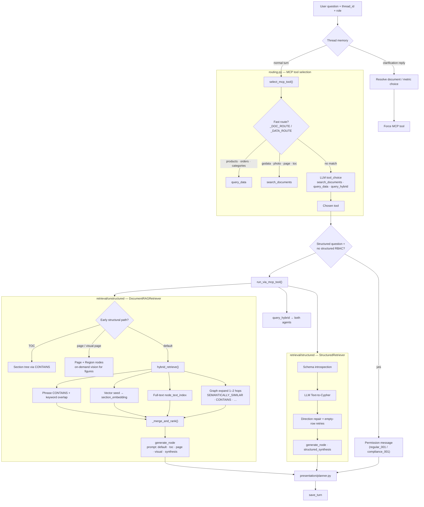

# Agentic GraphRAG

> A Neo4j-powered GraphRAG engine that unifies **structured analytics**, **document retrieval**, and **agentic orchestration** in a single knowledge layer.

Built with **Neo4j**, **FastAPI**, **LangGraph**, and **OpenAI**.

---

## Why This Exists

Most RAG systems treat all knowledge as flat chunks stored in a vector database.

That works well for semantic search, but breaks down when questions require:

- Multi-hop reasoning
- Aggregations and analytics
- Relationship-aware retrieval
- Role-based access control
- Understanding document hierarchy and structure

This project separates retrieval into two specialized paths:

### Structured knowledge

Business entities, metrics, customers, orders, products, compliance data, and graph relationships.

Retrieved using:

- Schema-aware Text-to-Cypher
- Neo4j graph traversal
- Aggregations and analytics

### Unstructured knowledge

Policies, PDFs, manuals, reports, and documents.

Retrieved using:

- Hierarchical document graphs
- Semantic search
- Full-text search
- Graph expansion
- Lexical phrase matching
- Visual and structural retrieval (TOC, pages, figures)

An **MCP-style routing layer** (`routing.py`) decides which retrieval strategy—or combination of strategies—is best for each query.

---

## Architecture

```text
                    User Query
                         │
                         ▼
                 MCP Query Router
                         │
         ┌───────────────┼───────────────┐
         │                               │
         ▼                               ▼
 Structured Agent            Unstructured Agent
(Text-to-Cypher)           (Document Graph RAG)
         │                               │
         └───────────────┬───────────────┘
                         ▼
                      Neo4j
                         │
                         ▼
                    Final Answer
```

---

## What Makes This Different?

| Capability | Traditional RAG | GraphRAG | Agentic GraphRAG |
|------------|-----------------|----------|------------------|
| Semantic search | ✅ | ✅ | ✅ |
| Document hierarchy | ❌ | ⚠️ | ✅ |
| Multi-hop reasoning | ❌ | ✅ | ✅ |
| Text-to-Cypher analytics | ❌ | ⚠️ | ✅ |
| Structured + unstructured retrieval | ❌ | ⚠️ | ✅ |
| Graph-native RBAC | ❌ | ⚠️ | ✅ |
| Agentic routing | ❌ | ❌ | ✅ |

---

## What's new (June 2026)

| Change | Details |
|--------|---------|
| **Lightweight PDF parser** | Replaced heavy parser with PyMuPDF + pdfplumber fallback. ~1 GB image, no Java/Docker-in-Docker. |
| **Image storage removed** | Binary page JPEGs are gone. Visual content (tables, charts, diagrams) is stored as `Page.visual_content` text in Neo4j and retrieved like any other node. |
| **Document versioning** | Every upload creates an immutable `DocRevision`. Re-ingesting the same file is a no-op. Changed files expire the old revision automatically. Fully supports millions of documents. |
| **Scalable ingestion pipeline** | Redis + RQ workers: concurrent uploads, durable job state, auto-retry with dead-letter, per-document Redis lock. Falls back to in-process `BackgroundTasks` when `REDIS_URL` is unset. |
| **Parallel Axis 2** | NER and LLM relationship passes run in parallel thread pools (8 NER / 6 LLM calls concurrently per doc). Candidate pairs capped by similarity score before hitting the LLM. |
| **Batched Neo4j writes** | `UNWIND` grouped by node label and relationship type replaces per-node transactions. Default chunk size 2 000. |
| **New API endpoints** | `GET /ingest/jobs` (list), `GET /ingest/queue/status` (depth + dead-letter). No more 409 on concurrent uploads. |

---

## Key features

### Agentic query routing

An MCP-style router analyzes incoming questions and selects:

- `search_documents`
- `query_data`
- `query_hybrid`

based on query intent, fast keyword signals, and user permissions.

### Structured retrieval

Schema-aware Text-to-Cypher generation against Neo4j.

Example:

```text
Which customers ordered the most?
```

Generates Cypher and returns ranked results.

Supports:

- Counts, averages, filters, grouping
- Relationship traversals and multi-hop paths
- Schema-driven repair when queries return empty results

### Unstructured retrieval

Documents are transformed into a navigable graph:

```text
Document
 └── Chapter
      └── Section
           └── Page
                └── Region
```

Retrieval combines:

- Vector search
- Full-text search
- Graph expansion
- Phrase and keyword overlap
- TOC navigation
- Page and visual retrieval

### Graph-native RBAC

Permissions are modeled inside Neo4j and enforced at retrieval time.

| Role | Documents | Structured data |
|------|-----------|-----------------|
| `public_001` | ✅ | ❌ |
| `regular_001` | ❌ | ✅ |
| `compliance_001` | ✅ | ✅ |
| `admin_001` | ✅ | ✅ |

### Hybrid retrieval

Questions that need both business metrics and document evidence can invoke multiple agents.

Example:

```text
Show compliance incidents from the policy documents
and summarize affected departments.
```

---

## Demo

| Ingestion | Unstructured | Structured |
| :---: | :---: | :---: |
| [](https://www.youtube.com/watch?v=2983DqSe0GM) | [](https://www.youtube.com/watch?v=s3Eceo20Eq4) | [](https://www.youtube.com/watch?v=XvigWQ5mB1g) |

---

## Quick start

```bash
git clone https://github.com/umerjavaidkh/agentic_graph_rag.git
cd agentic_graph_rag
cp .env.example .env
# Add OPENAI_API_KEY to .env
docker compose up --build
```

Open:

| Page | URL |
|------|-----|
| **Chat** | http://localhost:8000/chat |
| **Upload** | http://localhost:8000/upload |
| **API docs** | http://localhost:8000/docs |

PDF ingest is available in the default lightweight stack via PyMuPDF/pdfplumber.

---

## Example questions

### Structured

```text
Which customers ordered the most?
What are the top 5 products by sales?
Show monthly order volume.

# Advanced (tough) analytics
For each customer country, find the top 3 customers by total revenue in 1997
(revenue = sum of line items unitPrice × quantity × (1 - discount)), and for each of those customers return:
customer name / id, total revenue (1997), number of distinct orders (1997), average order value (1997),
their top 2 products by revenue (1997). Then rank countries by the sum of the top-3 customers’ revenue
and show the top 5 countries.

Find the top 5 supplier–category pairs by total revenue in 1997, where revenue is the sum of line items
unitPrice × quantity × (1 - discount). For each pair return: supplier name, category name, total revenue (1997),
number of distinct products sold (1997), number of distinct orders (1997), and the top 3 products
(names + revenue) within that supplier–category pair (1997).
```

### Unstructured

```text
What is the whistleblowing procedure?
Summarize section 3.
What must employees report?
```

### Hybrid

```text
Show compliance incidents and summarize
the related policy guidance.
```

---

## Deep dive

**Medium article:** [Agentic Graph RAG — architecture and walkthrough](https://medium.com/p/0ee1f6baae26)

---

## Tech stack

| Layer | Technology |
|-------|------------|
| Graph database | Neo4j 5.x |
| AI orchestration | LangGraph |
| API | FastAPI + Uvicorn |
| LLM / Embeddings | OpenAI (gpt-4o-mini, text-embedding-3-small) |
| PDF parsing | PyMuPDF + pdfplumber |
| Job queue | Redis + RQ (optional; in-process fallback when unset) |
| Container runtime | Docker / Docker Compose |
| Query language | Cypher |

---

## Detailed documentation

The sections below cover installation, Docker variants, the ingestion pipeline, **detailed architecture diagrams**, configuration, API reference, troubleshooting, and project layout.

---

## Prerequisites

- [Docker Desktop](https://www.docker.com/products/docker-desktop/) (recommended)
- An [OpenAI API key](https://platform.openai.com/api-keys)

> **Tip:** Docker is the easiest way to run everything. A local Python setup is possible but requires Neo4j and more manual steps (see [Local development](#local-development-without-docker)).

---

## Quick start (Docker — recommended)

### 1. Clone the repo

```bash
git clone https://github.com/umerjavaidkh/agentic_graph_rag.git
cd agentic_graph_rag
```

### 2. Create your environment file

```bash
cp .env.example .env
```

Open `.env` and set your OpenAI key:

```env
OPENAI_API_KEY=sk-your-real-key-here
```

> **Important:** Do **not** set `NEO4J_URI` in `.env` when using Docker with the bundled Neo4j container. Docker handles that automatically.

### 3. Start the stack

**Default (dev mode — no Redis, in-process jobs):**

```bash
docker compose up --build
```

Starts: Neo4j + API. Jobs run in a background thread inside FastAPI. Good for local development.

**With Redis workers (production / parallel ingestion):**

Add to `.env`:

```env
REDIS_URL=redis://redis:6379/0
```

Then start:

```bash
docker compose up --build
```

This starts: Neo4j + Redis + API + 1 worker. Scale workers:

```bash
docker compose up --scale worker=3
```

**Legacy full override** — backwards-compatible compose path, same lightweight parser:

```bash
docker compose -f docker-compose.yml -f docker-compose.full.yml up --build
```

First build may take several minutes. Later rebuilds are fast (Docker caches layers).

### 4. Open the app

Wait until you see `Uvicorn running on http://0.0.0.0:8000` in the logs, then open:

| Page | URL |
|------|-----|
| **Chat** | http://localhost:8000/chat |
| **Upload** | http://localhost:8000/upload |
| **API docs** | http://localhost:8000/docs |
| **Health check** | http://localhost:8000/health |

---

## Using the chat

1. Go to http://localhost:8000/chat
2. Type a question and press **Send**

The app routes each question to `query_data`, `search_documents`, or `query_hybrid`. See [Example questions](#example-questions) above.

---

## Uploading documents

Sample files for testing live in **`sample_data_to_test/`**:

```
sample_data_to_test/
├── unstructured/
│   ├── rag_document.pdf      # PDF for document RAG (full Docker image)
│   └── rag_document_2.pdf    # second PDF for multi-document / clarification tests
└── structured/
    └── northwind-data.cypher # structured graph load (products, orders, customers)
```

| File | Upload tab | Use for |
|------|------------|---------|
| `unstructured/*.pdf` | **Unstructured** | TOC, sections, page images, semantic search |
| `structured/northwind-data.cypher` | **Cypher** | Structured analytics (`query_data`) — requires `ALLOW_CYPHER_INGEST=true` and compliance/admin role |

1. Go to http://localhost:8000/upload
2. Choose a file from `sample_data_to_test/` (PDF requires the **full** Docker image)
3. Submit and wait for the ingestion job to finish
4. Ask questions about the document in **Chat**

Check job status via the API:

```bash
curl http://localhost:8000/ingest/jobs/{job_id}
```

Example upload from the repo root:

```bash
# Unstructured PDF (full stack)
curl -X POST http://localhost:8000/ingest/unstructured \
  -F "file=@sample_data_to_test/unstructured/rag_document.pdf" \
  -F "doc_key=rag-document"

# Structured Cypher (when ALLOW_CYPHER_INGEST=true)
curl -X POST http://localhost:8000/ingest/cypher \
  -F "file=@sample_data_to_test/structured/northwind-data.cypher" \
  -F "role=compliance_officer"
```

---

## Neo4j (graph database)

Neo4j runs in a separate container. It is **not** on the same port as the API.

| Purpose | URL / connection |
|---------|------------------|
| **Browser UI** | http://localhost:17474 |
| **Connect URL** (in Browser login) | `neo4j://localhost:17687` |
| **Username** | `neo4j` |
| **Password** | `password123` (default) |

> Ports **17474** and **17687** are used so Docker Neo4j does not clash with a local Neo4j on 7474 / 7687.

### Sample Cypher (Neo4j Browser)

```cypher
MATCH (c:Customer)-[:PURCHASED]->(o:Order)
RETURN c.companyName, count(o) AS orders
ORDER BY orders DESC
LIMIT 5
```

### Shell access

```bash
docker exec -it graphrag-neo4j cypher-shell -u neo4j -p password123
```

---

## Configuration

Copy `.env.example` → `.env`. Key settings:

### Core

| Variable | Required | Default | Description |
|----------|----------|---------|-------------|
| `OPENAI_API_KEY` | **Yes** | — | OpenAI key for chat, routing, and embeddings |
| `NEO4J_USER` | No | `neo4j` | Neo4j username |
| `NEO4J_PASSWORD` | No | `password123` | Neo4j password |
| `CHAT_MODEL` | No | `gpt-4o-mini` | LLM for chat and Axis 2 |
| `EMBEDDING_MODEL` | No | `text-embedding-3-small` | Embedding model |
| `APP_PORT` | No | `8000` | API port on host |
| `NEO4J_HTTP_PORT` | No | `17474` | Neo4j Browser port on host |
| `NEO4J_BOLT_PORT` | No | `17687` | Neo4j Bolt port on host |

### Ingestion pipeline (scalable mode)

| Variable | Default | Description |
|----------|---------|-------------|
| `REDIS_URL` | *(unset = dev mode)* | Set to `redis://redis:6379/0` to enable workers |
| `INGEST_QUEUE_NAME` | `ingest` | RQ queue name |
| `AXIS2_NER_CONCURRENCY` | `8` | Parallel NER LLM calls per document |
| `AXIS2_LLM_PAIR_CONCURRENCY` | `6` | Parallel relationship LLM calls per document |
| `AXIS2_MAX_LLM_PAIRS` | `300` | Cap on candidate pairs sent to the LLM pass |
| `NEO4J_WRITE_BATCH` | `2000` | UNWIND chunk size for Neo4j bulk writes |

### Document versioning

| Variable | Default | Description |
|----------|---------|-------------|
| `DOC_SKIP_DUPLICATE_HASH` | `true` | Skip ingest when ACTIVE revision already has the same SHA-256 |
| `DOC_VERSION_RETAIN_METADATA` | `true` | Keep expired `DocRevision` nodes for audit trail |

### PDF parser

| Variable | Default | Description |
|----------|---------|-------------|
| `ENABLE_PAGE_VISION` | `false` | Send selected pages to a vision model; stores descriptions in `Page.visual_content` |
| `PDF_ENABLE_PDFPLUMBER` | `true` | Use pdfplumber as fallback on low-text pages |
| `PDF_ENABLE_OCR` | `false` | Enable OCR fallback (requires Tesseract) |

### When to set `NEO4J_URI`

| How you run | `NEO4J_URI` in `.env` |
|-------------|------------------------|
| Docker + bundled Neo4j | **Leave unset** |
| Docker + Neo4j on your Mac | `bolt://host.docker.internal:7687` (see below) |
| API on Mac + Neo4j in Docker | `bolt://localhost:17687` |
| API on Mac + local Neo4j | `bolt://localhost:7687` |

---

## Docker commands cheat sheet

```bash
# Start (foreground — see logs)
docker compose up --build

# Start (background)
docker compose up -d --build

# Rebuild app only (after code changes — fast, uses cache)
docker compose up -d --build app

# Scale to 3 parallel ingestion workers (requires REDIS_URL in .env)
docker compose up --scale worker=3

# Stop
docker compose down

# Stop and wipe DB volumes
docker compose down -v

# View app logs
docker logs -f graphrag-app

# View worker logs
docker logs -f $(docker ps --filter name=worker --format '{{.Names}}' | head -1)

# Check queue depth and failed jobs
curl http://localhost:8000/ingest/queue/status | python3 -m json.tool

# List recent ingestion jobs
curl http://localhost:8000/ingest/jobs | python3 -m json.tool
```

---

## Docker variants

### Slim (default)

```bash
docker compose up --build
```

- ~1 GB app image
- Northwind structured queries + chat
- Lightweight PDF upload enabled

### Legacy full override

```bash
docker compose -f docker-compose.yml -f docker-compose.full.yml up --build
```

- Backwards-compatible compose override
- Lightweight PDF upload enabled

### External Neo4j (already running on your machine)

If you already have Neo4j on port `7687`:

```bash
# In .env set:
# NEO4J_PASSWORD=your-local-password

docker compose -f docker-compose.yml -f docker-compose.external-neo4j.yml up --build --scale neo4j=0
```

Load Northwind manually if the graph is empty: run `docker/northwind-docker.cypher` in Neo4j Browser.

---

## API quick reference

### Ask a question

```bash
curl -X POST http://localhost:8000/query \
  -H "Content-Type: application/json" \
  -d '{"question": "Which customers ordered the most?"}'
```

### Health check

```bash
curl http://localhost:8000/health
```

### Upload a PDF

```bash
curl -X POST http://localhost:8000/ingest/unstructured \
  -F "file=@sample_data_to_test/unstructured/rag_document.pdf" \
  -F "doc_key=rag-document"
```

The `doc_key` field is optional but recommended. Re-ingesting the same key with the same file → skipped (duplicate hash). Re-ingesting with a changed file → previous revision expired, new one loaded.

### Poll job status

```bash
# Single job
curl http://localhost:8000/ingest/jobs/{job_id} | python3 -m json.tool

# All recent jobs
curl http://localhost:8000/ingest/jobs | python3 -m json.tool

# Queue depth + dead-letter (failed) jobs
curl http://localhost:8000/ingest/queue/status | python3 -m json.tool
```

Job status response includes: `status`, `logical_doc_id`, `revision_id`, `version_number`, `skipped_duplicate`, `logs[]`, `dispatch` (`worker` or `background_task`).

See **`sample_data_to_test/`** for all sample PDFs and Cypher scripts.

Interactive API docs: http://localhost:8000/docs

---

## Architecture (detailed)

### End-to-end overview



### How ingestion works



**Axis 1 (document structure)** is always built first from the lightweight PDF parser:

- Hierarchy: `Document → Chapter → Section → Page → Region` (tables/figures).
- **Page vision** (optional): when `ENABLE_PAGE_VISION=true`, selected PDF pages are sent to a cheap vision model; tables, charts, diagrams, maps, and shapes are stored as `Page.visual_content` (text in Neo4j) for retrieval when normal text is missing or incomplete. The RAG stack does not store or serve binary page/region JPEGs.

**Axis 2 (semantic enrichment)** runs automatically when the server has an OpenAI key configured (embeddings, entity links, clustering, optional LLM relationship pass).

The result is exported as Neo4j import artifacts in `output/ingestion/<job_id>` (when `STORE_INGESTION_ARTIFACTS=true`) and loaded into Neo4j automatically when `AUTO_LOAD_TO_NEO4J=true`.

**Structured ingest (separate path):** upload a `.cypher` file → statements run directly in Neo4j (e.g. Northwind demo on first Docker start).

### How querying works



1. **Chat / API** receives the question, `thread_id`, and user role (`public_001`, `regular_001`, etc.).
2. **Thread memory** (`conversation/`) resolves follow-ups and clarification replies (document name, metric choice).
3. **MCP routing** (`routing.py`): fast keyword signals for document vs business-graph questions, then LLM tool choice if needed. Mis-routed document questions (e.g. photo credits) can fall back from denied structured access; business questions do **not** fall back to PDF search.
4. **RBAC** (`auth/`): `public_001` → documents only; `regular_001` → structured only; `compliance_001` / `admin_001` → both.
5. **Unstructured agent** (`retrieval/unstructured/graph.py`): `DocumentRAGRetriever.hybrid_retrieve()` uses structural shortcuts (TOC, page text, page visuals) or the full hybrid stack (lexical + semantic + full-text + graph expansion), then LLM synthesis with task-specific prompts.
6. **Structured agent** (`retrieval/structured/graph.py`): schema-driven **Text-to-Cypher** with relationship-direction repair and empty-result retries — works on any loaded graph schema (Northwind demo by default).
7. **Presentation** (`presentation/planner.py`) builds markdown, tables, charts, and image blocks for the chat UI.

### Neo4j graph contents

| Source | Main labels | Example relationships |
|--------|-------------|------------------------|
| Unstructured ingest | `Document`, `Chapter`, `Section`, `Page`, `Region` | `CONTAINS`, Axis-2 semantic edges |
| Structured ingest | `Product`, `Order`, `Customer`, … (any schema) | Domain relationships from Cypher |
| RBAC | `User`, `Role`, `KnowledgeArea` | `esg` (documents) · `structured` (business graph) |

### RBAC and routing (demo users)

| User | Documents (`esg`) | Structured DB | Typical questions |
|------|-------------------|-----------------|-------------------|
| `public_001` | Yes | No | Go.Data report, policies, photo credits, page 29 |
| `regular_001` | No | Yes | Beverages products, orders, customers |
| `compliance_001` | Yes | Yes | Both corpora |
| `admin_001` | Yes | Yes | Both corpora |

### Ingestion ↔ query config

| Variable | Effect |
|----------|--------|
| `ENABLE_PAGE_VISION` | Vision text on selected PDF pages |
| `AUTO_LOAD_TO_NEO4J` | Load graph after export |
| `STORE_INGESTION_ARTIFACTS` | Write `output/ingestion/<job_id>` |
| `OPENAI_API_KEY` | Chat, routing, embeddings; enables Axis 2 and optional vision |
| `DOC_SKIP_DUPLICATE_HASH` | Skip parse/load when the ACTIVE revision already has the same file SHA-256 |
| `DOC_VERSION_RETAIN_METADATA` | Keep expired `DocRevision` nodes (content subgraph is still purged on new revision) |

### Document versioning (millions-of-docs ready)

Each upload is keyed by a **logical document** (`doc_key` form field, or filename slug) and stored as an immutable **revision snapshot**:

- `DocumentLogical` — stable id (`godata-manual`, `rag-document`, …)
- `DocRevision` — `v1`, `v2`, … with `content_hash`, `ACTIVE` / `EXPIRED`
- Content nodes (`Document`, `Section`, `Page`, …) carry `logical_doc_id`, `revision_id`, `lifecycle_status`

Re-ingest the same file → skipped when `DOC_SKIP_DUPLICATE_HASH=true`. Upload a changed PDF under the same `doc_key` → previous revision expired, new subgraph loaded. Retrieval only sees `lifecycle_status = ACTIVE` (legacy nodes without the field still match).

Poll `GET /ingest/jobs/{job_id}` for `logical_doc_id`, `revision_id`, `version_number`, `skipped_duplicate`.

---

### Scalable ingestion pipeline (Redis + RQ workers)

The default single-process mode (`REDIS_URL` unset) runs jobs inside FastAPI via `BackgroundTasks` — great for local dev, no extra services required.

For production / high-volume ingestion, set `REDIS_URL` to switch to the **Redis + RQ** path automatically:

```
REDIS_URL=redis://redis:6379/0
```

#### What changes with Redis

| Aspect | Default (no Redis) | Redis + Workers |
|--------|-------------------|-----------------|
| Job storage | In-process dict | Redis hash (survives restarts) |
| Dispatch | `BackgroundTasks` | RQ queue → workers |
| Concurrency | 2 thread pool | N worker processes (scale freely) |
| Retries | None | 2 retries with 30 s / 2 min back-off |
| Dead-letter | None | `GET /ingest/queue/status` |
| Per-doc locking | N/A | Redis lock (same doc serialised, different docs parallel) |

#### Scale workers

```bash
# Start 3 parallel ingestion workers
docker compose up --scale worker=3

# Check queue depth and failed jobs
curl http://localhost:8000/ingest/queue/status

# List recent jobs
curl http://localhost:8000/ingest/jobs
```

#### Inspect failed jobs (dead-letter)

```bash
curl http://localhost:8000/ingest/queue/status | python3 -m json.tool
```

Returns `failed_jobs[]` with `rq_job_id`, `exc_info`, `ended_at` for each exhausted job.

#### Concurrency knobs

All exposed via `.env` / environment:

| Variable | Default | Description |
|----------|---------|-------------|
| `REDIS_URL` | *(unset)* | Redis URL; unset = in-process mode |
| `INGEST_QUEUE_NAME` | `ingest` | RQ queue name |
| `INGEST_WORKER_CONCURRENCY` | `2` | Thread pool per worker process |
| `AXIS2_NER_CONCURRENCY` | `8` | Parallel NER LLM calls per doc |
| `AXIS2_LLM_PAIR_CONCURRENCY` | `6` | Parallel relationship LLM calls per doc |
| `AXIS2_MAX_LLM_PAIRS` | `300` | Max candidate pairs sent to LLM relationship pass |
| `NEO4J_WRITE_BATCH` | `2000` | UNWIND batch size for Neo4j bulk writes |

#### Architecture (with Redis)

```
Client  ──POST /ingest/unstructured──►  API (FastAPI)
                                              │
                                   save upload to shared volume
                                   create job in Redis
                                              │
                                         enqueue job_id
                                              │
                    ┌─────────────────────────▼───────────────────┐
                    │              Redis "ingest" queue            │
                    └──────┬────────────────────────┬─────────────┘
                           │                        │
                        Worker 1                 Worker N
                           │                        │
                   run_ingest_job()         run_ingest_job()
                  ┌────────┴────────┐
                  │  per-doc lock   │  ← different docs run in parallel
                  │  (Redis lock)   │    same doc serialised
                  └────────┬────────┘
                  parse → Axis2 (parallel NER + LLM)
                  → batched Neo4j UNWIND writes
                  → update job status in Redis
                           │
Client  ──GET /ingest/jobs/{id}──►  API reads status from Redis ──► 200
```

---

## Project structure

```
agentic_graph_rag/
├── sample_data_to_test/
│   ├── unstructured/          # rag_document.pdf, rag_document_2.pdf
│   └── structured/            # northwind-data.cypher
├── src/
│   ├── api.py                 # FastAPI app — routes, dispatch, job list, queue status
│   ├── bridge.py              # ask() entry point for API
│   ├── router.py              # MCP handlers: search_documents, query_data, query_hybrid
│   ├── routing.py             # MCP tool selection (fast route + LLM + RBAC fallback)
│   ├── config/
│   │   └── settings.py        # All env-var settings incl. Redis, Axis 2, Neo4j batch
│   ├── ingestion/
│   │   ├── service.py         # IngestionManager (store-backed, per-doc Redis lock)
│   │   ├── job_store.py       # JobStore ABC, RedisJobStore, InMemoryJobStore
│   │   ├── queue.py           # RQ queue, enqueue_ingest, dead-letter helpers
│   │   ├── tasks.py           # run_ingest_job() — RQ worker callable
│   │   └── models.py          # IngestionStatus enum
│   ├── document/
│   │   ├── parser.py          # LightPdfParser (PyMuPDF + pdfplumber fallback)
│   │   ├── page_vision.py     # PageVisionEnricher (optional, vision model)
│   │   └── versioning.py      # Logical doc ID, revision plans, content hashing
│   ├── exporter/
│   │   └── exporter.py        # Neo4jExporter — UNWIND batched writes
│   ├── semantic/
│   │   └── axis2.py           # Axis 2 (parallel NER + LLM relationship pass)
│   ├── retrieval/
│   │   ├── unstructured/
│   │   │   ├── retriever.py   # DocumentRAGRetriever (hybrid + TOC + visual)
│   │   │   └── toc_retrieval.py  # TOC scoring + outline helpers
│   │   └── structured/
│   │       └── retriever.py   # Schema-driven Text-to-Cypher + repair
│   ├── graph/
│   │   ├── constants.py       # Neo4j label/rel constants
│   │   └── versioning.py      # lifecycle_active() query helper
│   ├── presentation/          # UI blocks (markdown, tables, charts)
│   ├── conversation/          # Thread memory + clarification
│   ├── auth/                  # RBAC (roles, knowledge areas)
│   └── prompts/               # LLM prompts
├── tests/
│   ├── test_scalable_pipeline_unit.py  # JobStore, queue wiring, Axis 2, exporter batch
│   ├── test_document_versioning_unit.py
│   └── test_toc_retrieval_unit.py
├── scripts/
│   └── verify_document_versioning.sh
├── docker-compose.yml         # Neo4j + Redis + API + worker services
├── Dockerfile
├── Dockerfile.full
└── .env.example
```

---

## Troubleshooting

### Chat/upload not loading (connection refused on :8000)

Check if the app container is running:

```bash
docker ps --filter name=graphrag
docker logs graphrag-app --tail 50
```

If the app exited, common causes:

- Missing or placeholder `OPENAI_API_KEY` in `.env`
- `NEO4J_URI=bolt://localhost:7687` in `.env` while using Docker — **remove that line**

Restart:

```bash
docker compose up -d app
```

### Neo4j Browser: "Connection to instance failed"

Use the **mapped** port, not the default Neo4j port:

| Wrong | Correct |
|-------|---------|
| `bolt://localhost:7687` | `neo4j://localhost:17687` |

Browser URL: http://localhost:17474

### Container name already in use

```bash
docker rm graphrag-neo4j graphrag-app
docker compose up -d
```

### Rebuild takes forever

Only rebuild the app after code changes:

```bash
docker compose up -d --build app
```

Requirements/Dockerfile changes trigger a full pip install again.

### Worker not picking up jobs

If you set `REDIS_URL` but jobs stay in `queued` status:

1. Check that the worker container is running:
```bash
docker ps --filter name=worker
docker logs $(docker ps --filter name=worker -q | head -1) --tail 30
```

2. Verify Redis is healthy:
```bash
docker exec graphrag-redis redis-cli ping  # should return PONG
```

3. Check queue depth:
```bash
curl http://localhost:8000/ingest/queue/status
```

4. If jobs appear in `failed_jobs[]`, they exhausted 2 retries. Check `exc_info` in the response for the root cause.

### Job status lost after restart (in-process mode)

When `REDIS_URL` is unset, job state lives only in the API process memory. It is lost on restart. Set `REDIS_URL` to use durable Redis storage.

### Access denied on structured queries

Roles are enforced per knowledge area:

- **Products / orders / categories** → needs structured access (`regular_001`, `compliance_001`, `admin_001`).
- **PDF / policy / Go.Data questions** → needs document access (`public_001`, `compliance_001`, `admin_001`).

If you see a permission message for the business database, switch the chat user to `regular_001` or `compliance_001`. If document answers mention “business database,” you asked a Northwind-style question while using a documents-only role.

Check RBAC in Neo4j: `src/auth/rbac_schema.cypher`.

---

## Local development (without Docker)

1. Install **Python 3.11+** and **Neo4j 5.x**
2. Create a virtualenv and install dependencies:

```bash
python -m venv venv
source venv/bin/activate   # Windows: venv\Scripts\activate
pip install -r requirements.txt
```

3. Configure `.env`:

```env
OPENAI_API_KEY=sk-your-key
NEO4J_URI=bolt://localhost:7687
NEO4J_USER=neo4j
NEO4J_PASSWORD=your-password
```

4. Start Neo4j, load demo data if needed, then run the API:

```bash
uvicorn src.api:app --reload --host 0.0.0.0 --port 8000
```

---

## Security notes

- **Never commit `.env`** — it is gitignored; use `.env.example` as a template
- `ALLOW_CYPHER_INGEST` and `ALLOW_DB_RESET` are dangerous in production — keep them `false` unless you know what you are doing
- Rotate your OpenAI key if it was ever exposed

---

## License

Private repository — use and share according to your own terms.

---

## Need help?

1. Check logs: `docker logs -f graphrag-app`
2. Verify health: http://localhost:8000/health
3. Verify Neo4j: http://localhost:17474 with `neo4j://localhost:17687`

For walkthroughs, see the [Demo](#demo) videos at the top of this README.
