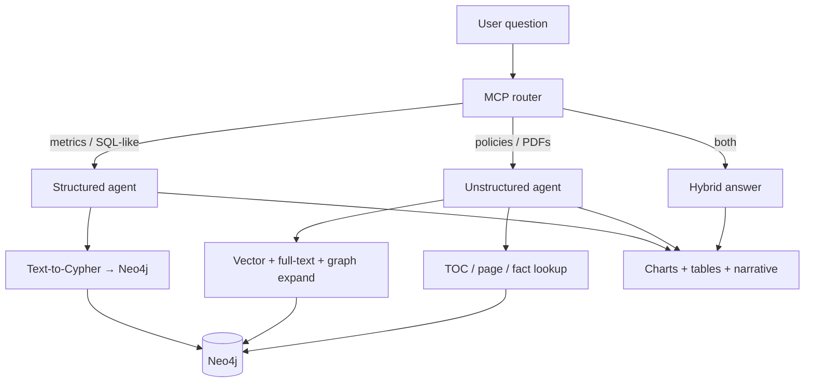

# Agentic GraphRAG

**One Neo4j graph. Two knowledge modes. Answers that flat RAG cannot reliably give.**

## Demos

**1. Ingestion pipeline** — drop PDFs in the bulk-upload UI and watch them become a versioned Neo4j knowledge graph (lightweight parser, parallel NER + LLM extraction, batched writes, live job status).

[](https://youtu.be/K4XIat6xpEw)

> ▶️ Watch: https://youtu.be/K4XIat6xpEw

**2. Retrieval + eval run** — the **30-case eval suite** answered live in the chat UI: 20 unstructured document questions + 10 structured analytics questions (bar/line/doughnut charts), each validated with an on-screen PASS/FAIL banner. Final score: **30/30**.

[](https://youtu.be/7011-xkI1RI)

> ▶️ Watch: https://youtu.be/7011-xkI1RI

---

Agentic GraphRAG is a production-oriented **Graph RAG** stack that keeps **structured business data** and **unstructured documents** in the same graph database, then routes each question to the right retrieval strategy—or combines both. You get SQL-grade analytics on Northwind-style entities *and* multi-hop reasoning over WHO reports, policies, and manuals—without maintaining separate vector DBs, ETL pipelines, and ad-hoc orchestration glue.

Built with **Neo4j · FastAPI · LangGraph · OpenAI**.

---

## Current status

The core platform is **feature-complete** for a production-oriented v1:

| Area | Status |
|------|--------|
| Dual-graph RAG (structured + documents + hybrid) | ✅ |
| Scalable ingestion (Redis + RQ workers, versioning) | ✅ |
| Google OIDC auth, RBAC, per-user thread isolation | ✅ (`release/v1.0`) |
| Dev sidebar auth (no Google UI on `master`) | ✅ |
| Streaming answers (`/query/stream`) with charts | ✅ |
| Retrieval feedback loop + ops dashboard (`/feedback`) | ✅ |
| Regression eval suites | ✅ |

### Branch strategy

| Branch | Auth in UI | Use case |
|--------|------------|----------|
| **`master`** (default) | Sidebar **User ID** + **Role** — no Google sign-in in `/chat` or `/upload` | Local dev, eval, demos |
| **`release/v1.0`** | **Sign in with Google** (OIDC JWT) + full production RBAC | Deployments with real identity |

Both branches share the same RAG, ingestion, feedback, and eval features. Only the login UX and default env differ.

### Roadmap (future)

| Planned | Description |
|---------|-------------|
| **Short memory (per user)** | Recent turns and session context across a thread — beyond today's single last-turn snapshot |
| **Long memory (per user)** | Durable facts and preferences retrieved at query time (graph-backed or dedicated store) |
| **Multi-language** | Query and answer in multiple languages (detection, prompts, and UI i18n) |

---

## Why this is different

| Typical flat RAG | Agentic GraphRAG |
|------------------|------------------|
| One chunk index for everything | **Dedicated graphs** for tables vs. documents |
| Similarity search only | **Cypher** for metrics + **hybrid retrieval** for PDFs |
| Weak on counts, joins, time series | **Aggregations, rankings, charts** from live Neo4j |
| Loses document structure | **Hierarchy**: Document → Chapter → Section → Page → Region |
| Single-hop Q&A | **Multi-hop** paths across entities, networks, and field stories |
| Guesses when context is missing | **Eval suite** includes anti-hallucination and empty-result cases |

**Unique in practice:** the same user session can ask *“Top 5 products by revenue in 1997”* (structured) and *“Which field epidemiology network deployed fellows to Greece and Kosovo?”* (unstructured, 2–3 hop)—with an **LLM MCP router** choosing `query_data` vs. `search_documents`, RBAC enforcing who sees what, and the chat UI rendering **tables, bar/line/doughnut charts**, or narrative answers as appropriate.

---

## What it does



| Mode | Best for | Examples |
|------|----------|----------|
| **Structured** | Counts, filters, rankings, time series, BI | *“Monthly order count in 1997”* · *“Revenue share by category”* |
| **Unstructured** | Facts, relationships, timelines, synthesis over PDFs | *“ISBN of the annual report”* · *“Network that deployed fellows to Malta and Moldova”* |
| **Hybrid** | Incidents + policy context in one answer | *“Show compliance incidents and summarize related policy guidance”* |

**Unstructured retrieval is not “vector-only.”** It layers semantic search, lexical match, graph expansion from extracted entities, structural TOC/page fetch, and phrase-based fact lookup (URLs, licenses, abbreviations)—so complex questions anchor on the right section before synthesis.

**Structured retrieval is not “text-to-SQL on CSV.”** It uses your **Neo4j schema** (Northwind demo or your own Cypher ingest), schema-aware repair, multistep plans for hard questions, and automatic chart selection (bar, horizontal bar, line, pie/doughnut).

---

## Complex questions this stack is built for

Try these in chat, or run the bundled eval suites (`python3 scripts/run_rag_eval.py --help`):

| Complexity | Structured (Northwind · `regular_001` / `regular_office`) | Unstructured (Go.Data · `public_001`) |
|------------|-----------------------------------------------------------|----------------------------------------|
| **Lookup** | Which supplier provides Chai? | What is the electronic version ISBN of the Go.Data annual report 2021? |
| **Aggregation** | How many products exist in each category? | How many countries and territories were supported during 2020–2021? |
| **Multi-hop** | Which customers purchased products in the Seafood category? | Which network deployed alumni to Greece, Malta, Moldova, and Kosovo? |
| **Temporal** | Show monthly order count in 1997. | Which deployment came first: Cox's Bazar or Kasese, Uganda? |
| **Compare / synthesize** | Revenue share by category (doughnut). | Contrast proximity tracing tools vs. Go.Data as categorized by WHO. |
| **Anti-hallucination** | Which categories have never appeared in an order? | Which Silicon Valley firm wrote the Go.Data iOS app? *(should deny—not invent)* |

---

## Tech stack

| Layer | Technology |
|-------|------------|
| Graph database | Neo4j 5.x |
| AI orchestration | LangGraph |
| API | FastAPI + Uvicorn |
| LLM / Embeddings | OpenAI (gpt-4o-mini, text-embedding-3-small) |
| PDF parsing | PyMuPDF + pdfplumber |
| Job queue | Redis + RQ *(optional — in-process fallback when unset)* |
| Containers | Docker / Docker Compose |

---

## Quick start

```bash
git clone https://github.com/umerjavaidkh/agentic_graph_rag.git
cd agentic_graph_rag
cp .env.example .env          # add OPENAI_API_KEY
docker compose up --build
```

Open:

| Page | URL |
|------|-----|
| **Chat** | http://localhost:8000/chat |
| **Upload** | http://localhost:8000/upload |
| **Feedback monitor** | http://localhost:8000/feedback |
| **API docs** | http://localhost:8000/docs |
| **Health** | http://localhost:8000/health |

> Do **not** set `NEO4J_URI` in `.env` when using the bundled Docker Neo4j — it is wired automatically.

### Enable Redis workers (parallel ingestion)

Add to `.env`:

```env
REDIS_URL=redis://redis:6379/0
```

Then:

```bash
docker compose up --build              # starts Neo4j + Redis + API + 1 worker
docker compose up --scale worker=3    # scale to 3 parallel workers
```

Without `REDIS_URL`, jobs run inside FastAPI via `BackgroundTasks` — fine for local dev.

---

## Uploading documents

Go to **http://localhost:8000/upload**:

- **Drop multiple PDFs** onto the drop zone — they are submitted concurrently.
- Each file appears as a live job card with status, dispatch mode (`WORKER` / `IN-PROCESS`), version, and expandable logs.
- The **queue status bar** shows Redis connectivity, queue depth, and failed job count.

Or via `curl`:

```bash
# Single PDF
curl -X POST http://localhost:8000/ingest/unstructured \
  -F "file=@sample_data_to_test/unstructured/rag_document.pdf" \
  -F "doc_key=rag-document"

# Cypher data (requires ALLOW_CYPHER_INGEST=true + admin role)
curl -X POST http://localhost:8000/ingest/cypher \
  -F "file=@sample_data_to_test/structured/northwind-data.cypher" \
  -F "user_id=admin_001" \
  -F "role=admin"
```

`doc_key` controls versioning: same key + same file → skipped; same key + changed file → new revision.

**Ingestion requires `role=admin`** — on `master`, use the **User ID / Role** picker on `/upload` (`admin_001` + `admin`). On `release/v1.0`, sign in with Google as a mapped admin — see [Authentication & roles](#authentication--roles).

---

## Try it in chat

### Dev sidebar (`master` default — `AUTH_ENABLED=false`)

Open `/chat`, pick **User ID** and **Role** in the sidebar. No Google sign-in.

| Track | Prerequisite | User ID | Role |
|-------|--------------|---------|------|
| **Structured** | Northwind loaded | `regular_001` | `regular_office` |
| **Unstructured** | PDF ingested | `public_001` | `public` |
| **Hybrid** | Both loaded | `compliance_001` | `compliance_officer` |
| **Ingestion** | — | `admin_001` | `admin` (use `/upload`) |

**Structured quick checks:**
```
Which customers ordered the most?
Top 5 products by sales revenue in 1997?
```

**Unstructured quick checks:**
```
List all the table of contents from the Go.Data document.
What is the URL for the Go.Data Community of Practice portal?
```

**Hybrid:**
```
Show compliance incidents and summarize the related policy guidance.
```

### Google OIDC (`release/v1.0` — `AUTH_ENABLED=true`)

Check out `release/v1.0` for **Sign in with Google** in `/chat` and `/upload`.

1. Set `GOOGLE_CLIENT_ID` in `.env` and register `http://localhost:8000` as an **Authorized JavaScript origin** in Google Cloud Console.
2. Open `/chat` → **Sign in with Google**.
3. Default signed-in users get **`compliance_officer`** (documents + structured). Emails listed in `AUTH_EMAIL_ROLE_MAP` with `=admin` can use `/upload` for ingestion.

| Track | Prerequisite | Signed-in role |
|-------|--------------|----------------|
| **Structured** | Northwind loaded via `/upload` (admin) | `compliance_officer` or `admin` |
| **Unstructured** | PDF ingested via `/upload` (admin) | `compliance_officer` or `admin` |
| **Hybrid** | Both loaded | `compliance_officer` or `admin` |
| **Ingestion** | Admin email in `AUTH_EMAIL_ROLE_MAP` | `admin` only |

### Regression eval (optional)

Smoke suites under `eval/` exercise routing, answers, charts, and anti-hallucination cases against `/query`. Corpus-specific expectations live in JSON only — not in retriever code.

```bash
python3 scripts/run_rag_eval.py --suite all          # document + structured + advanced
python3 scripts/run_rag_eval.py --attach-feedback    # label pass/fail for feedback loop
pytest tests/test_rag_eval_validators.py -q
```

Set `EVAL_BASE_URL` (default `http://localhost:8000`) and `EVAL_TIMEOUT` (default `180`) for slow LLM calls.

---

## Feedback monitor

A dedicated **ops window** at **http://localhost:8000/feedback** shows how the feedback loop is performing — separate from chat, read-only, auto-refreshes every 30 seconds.

Requires `RETRIEVAL_FEEDBACK_ENABLED=true` in `.env` (and `docker compose up -d --build app` after changes).

### What you see

| Panel | Purpose |
|-------|---------|
| **KPI cards** | Recording on/off, routing apply on/off, store type (Redis or JSONL), event and label counts |
| **Label coverage chart** | Pass / fail / unlabeled breakdown |
| **Pass rate by mode** | Which retrieval modes (`graph_rag_lexical`, `text2cypher`, etc.) perform best |
| **Patterns table** | Learned question buckets, pass rates, retrieval + route hints, whether routing **would apply** |
| **Recent events** | Last queries: `request_id`, mode, route, outcome, whether `feedback.routing` ran |
| **Question probe** | Type any question to inspect pattern stats via `/feedback/stats` |

### Chat thumbs (👍 / 👎)

When `RETRIEVAL_FEEDBACK_ENABLED=true`, each assistant reply in `/chat` shows **Helpful?** buttons. A click posts to `POST /feedback/outcome` with that message’s `request_id` (same path as eval labeling). Votes appear on the dashboard after refresh.

### Typical workflow

1. Enable feedback in `.env`:
   ```env
   RETRIEVAL_FEEDBACK_ENABLED=true
   RETRIEVAL_FEEDBACK_ROUTING=false   # observe first; set true when labels are ready
   RETRIEVAL_FEEDBACK_STORE_QUESTION=false
   REDIS_URL=redis://redis:6379/0
   ```
2. Use **chat** or run eval with `--attach-feedback` to label pass/fail.
3. Open **/feedback** in a second browser tab while testing.
4. When patterns have enough labeled samples (`RETRIEVAL_FEEDBACK_MIN_SAMPLES`), enable `RETRIEVAL_FEEDBACK_ROUTING=true` and watch **Routing applied** in recent events.

### API

| Endpoint | Description |
|----------|-------------|
| `GET /feedback` | Dashboard UI |
| `GET /feedback/dashboard` | JSON aggregate (powers the UI) |
| `GET /feedback/stats?question=…` | Stats + hint for one question pattern |
| `POST /feedback/outcome` | Attach pass/fail to a prior `request_id` |

Feedback shares the same Redis instance as ingestion (different key namespaces). Fine for current scale; see architecture notes if you outgrow a single Redis.

---

## Architecture

**Query path**

```
User Query → MCP Router (routing.py + feedback_loop resolver)
                 ├─ Structured Agent → Text-to-Cypher / multistep → Neo4j → charts/tables
                 ├─ Unstructured Agent → hybrid retrieval → Neo4j → narrative + sources
                 └─ Hybrid (compliance role) → both paths → merged answer
                      │
                      ▼
              feedback_loop (observe → label → learn → optional apply)
```

**Feedback loop** (`src/feedback_loop/`) — observe pipeline telemetry, label outcomes, optionally improve routing:

| Stage | What happens |
|-------|----------------|
| **Observe** | After `/query` and `/query/stream`, persist compact telemetry (Redis stream or JSONL) |
| **Label** | `POST /feedback/outcome` or eval `--attach-feedback` marks pass/fail per `request_id` |
| **Learn** | Aggregate pass rates by question **pattern** (intent flags) + retrieval mode or route tool |
| **Apply** | When `RETRIEVAL_FEEDBACK_ROUTING=true`, `FeedbackRoutingService` adjusts multistep vs text2cypher, document hybrid mode, or MCP route — only after enough labeled samples |

See **[Feedback monitor](#feedback-monitor)** below for the ops UI. Application code imports from `src/feedback_loop`; `src/telemetry/feedback/` is a deprecated shim.

**Unstructured retrieval modes** (selected per question): vector similarity · full-text · graph expand from NER · TOC structural fetch · page-by-number · phrase/fact lookup (URLs, licenses).

**Ingestion write path:**

```
PDF → LightPdfParser
        │
        ├── Axis 1: Document → Chapter → Section → Page → Region
        ├── Page vision (optional, ENABLE_PAGE_VISION=true)
        └── Axis 2: Embeddings · NER · Clustering · LLM relationship pass
                      (parallel thread pools)
              │
              └── Neo4jExporter (UNWIND batched writes) → Neo4j
```

**With Redis workers:**

```
POST /ingest  →  API  →  Redis queue
                              │
                    ┌─────────┴─────────┐
                 Worker 1           Worker N
                    │                   │
             per-doc Redis lock (same doc serialised, different docs parallel)
             parse → Axis 2 → batched Neo4j writes → update job in Redis
                              │
GET /ingest/jobs/{id}  →  reads from Redis  →  200
```

---

## Configuration

Copy `.env.example` → `.env`. Key variables:

### Core

| Variable | Default | Description |
|----------|---------|-------------|
| `OPENAI_API_KEY` | **required** | LLM, embeddings, routing |
| `NEO4J_USER` | `neo4j` | Neo4j username |
| `NEO4J_PASSWORD` | `password123` | Neo4j password |
| `CHAT_MODEL` | `gpt-4o-mini` | Document RAG synthesis; default for other stages |
| `STRUCTURED_MODEL` | *(CHAT_MODEL)* | Text-to-Cypher + structured answers |
| `ROUTING_MODEL` | *(CHAT_MODEL)* | MCP routing (`search_documents` vs `query_data`) |
| `AXIS2_MODEL` | *(CHAT_MODEL)* | Ingestion NER + relationship LLM pass |
| `EMBEDDING_MODEL` | `text-embedding-3-small` | Retrieval + ingest embeddings |
| `VISION_MODEL` | `gpt-4o-mini` | Page vision (`ENABLE_PAGE_VISION=true`) |

| `APP_PORT` | `8000` | API port |

Active model resolution: `GET /config/models`

### Authentication & roles

**`master` (default):** `AUTH_ENABLED=false` — sidebar `user_id` + `role` for `/query`; `/upload` and `/admin/*` require `role=admin` via form/query params.

**`release/v1.0`:** `AUTH_ENABLED=true` + `GOOGLE_CLIENT_ID` — Sign in with Google in the UI; JWT overrides body identity.

| Variable | Default (`master`) | Description |
|----------|-------------------|-------------|
| `AUTH_ENABLED` | `false` | `true` → chat/upload require Google (or OIDC); use on `release/v1.0` |
| `GOOGLE_CLIENT_ID` | *(empty)* | OAuth 2.0 Web client ID — **GIS button on `release/v1.0` only** |
| `AUTH_DEFAULT_ROLE` | `compliance_officer` | Role assigned to new Google users (chat: documents + structured) |
| `AUTH_EMAIL_ROLE_MAP` | *(empty)* | Comma-separated `email=role` overrides, e.g. `you@corp.com=admin` |
| `AUTH_JIT_PROVISION` | `true` | On each login, sync User + `HAS_ROLE` in Neo4j from config/maps |
| `AUTH_ALLOW_BODY_FALLBACK` | `true` when auth off | `true` → unsigned `/query` may send `user_id`/`role` in JSON (eval/dev). Set **`false` in production**. |
| `AUTH_PROVIDER` | `google` | `google` or `oidc` (corporate IdP via `OIDC_ISSUER`, `OIDC_AUDIENCE`) |
| `AUTH_CLAIM_ROLE_MAP` | *(empty)* | Optional IdP group → role map (JSON or `Group=role` pairs) |

**Admin configuration (ingestion on `release/v1.0`):** map operator Google emails to `admin` in `.env`:

```env
# release/v1.0 production example
AUTH_ENABLED=true
GOOGLE_CLIENT_ID=your-client-id.apps.googleusercontent.com
AUTH_DEFAULT_ROLE=compliance_officer
AUTH_EMAIL_ROLE_MAP=you@company.com=admin
AUTH_ALLOW_BODY_FALLBACK=false   # production: Google only for /query
```

**Dev defaults on `master`:**

```env
AUTH_ENABLED=false
AUTH_ALLOW_BODY_FALLBACK=true
```

- **`admin`** — ingestion (`/upload`, `/ingest/*`), `/admin/reset-neo4j`, full RBAC.
- **`compliance_officer`** — chat only (`/query`, `/query/stream`): documents + structured data.
- **`regular_office`** — structured data only (demo user `regular_001`).
- **`public`** — document graph only (demo user `public_001`).

When a Bearer JWT is present, the server **ignores** sidebar/body `user_id` and `role` — identity comes from Google claims + maps above.

Public config for the UI: `GET /auth/config` · current principal: `GET /auth/me` (with `Authorization: Bearer …`).

### Ingestion & scalability

| Variable | Default | Description |
|----------|---------|-------------|
| `REDIS_URL` | *(unset = in-process)* | Set to `redis://redis:6379/0` for workers |
| `INGEST_QUEUE_NAME` | `ingest` | RQ queue name |
| `AXIS2_NER_CONCURRENCY` | `8` | Parallel NER calls per doc |
| `AXIS2_LLM_PAIR_CONCURRENCY` | `6` | Parallel LLM relationship calls per doc |
| `AXIS2_MAX_LLM_PAIRS` | `300` | Cap on candidate pairs sent to LLM |
| `NEO4J_WRITE_BATCH` | `2000` | UNWIND chunk size for bulk writes |
| `DOC_SKIP_DUPLICATE_HASH` | `true` | Skip ingest when same file already active |
| `DOC_VERSION_RETAIN_METADATA` | `true` | Keep expired `DocRevision` nodes for audit |
| `ENABLE_PAGE_VISION` | `false` | Vision model descriptions for PDF pages |
| `ALLOW_CYPHER_INGEST` | `false` | Enable `.cypher` file upload endpoint |
| `ALLOW_DB_RESET` | `false` | Enable `/admin/reset-neo4j` |

### Retrieval feedback loop

| Variable | Default | Description |
|----------|---------|-------------|
| `RETRIEVAL_FEEDBACK_ENABLED` | `false` | Record pipeline telemetry after queries (no behavior change) |
| `RETRIEVAL_FEEDBACK_ROUTING` | `false` | Apply labeled hints to routing/retrieval (`true` = self-improvement) |
| `RETRIEVAL_FEEDBACK_STORE_QUESTION` | `false` | Store first 120 chars of question in feedback events (privacy: keep `false` in prod) |
| `RETRIEVAL_FEEDBACK_MIN_SAMPLES` | `30` | Minimum labeled outcomes before a hint can apply |
| `RETRIEVAL_FEEDBACK_MIN_MARGIN` | `0.15` | Required pass-rate gap between best and second-best mode |
| `REDIS_URL` | *(unset)* | Recommended for production feedback aggregates (same Redis as ingestion) |

```bash
# Label a prior query (e.g. from eval or thumbs)
curl -X POST http://localhost:8000/feedback/outcome \
  -H "Content-Type: application/json" \
  -d '{"request_id": "abc123", "passed": true}'

# Inspect pattern stats + suggested hint (read-only)
curl "http://localhost:8000/feedback/stats?question=Top%205%20products%20by%20revenue&agent=structured"

# Full ops dashboard JSON (powers /feedback UI)
curl http://localhost:8000/feedback/dashboard
```

### NEO4J_URI — when to set it

| Setup | Value |
|-------|-------|
| Docker + bundled Neo4j | **Leave unset** |
| Docker + Neo4j on your Mac | `bolt://host.docker.internal:7687` |
| API on Mac + Neo4j in Docker | `bolt://localhost:17687` |
| API on Mac + local Neo4j | `bolt://localhost:7687` |

---

## API reference

```bash
# Query (dev — body user_id/role when AUTH_ALLOW_BODY_FALLBACK=true)
curl -X POST http://localhost:8000/query \
  -H "Content-Type: application/json" \
  -d '{"question": "Which customers ordered the most?", "user_id": "regular_001", "role": "regular_office"}'

# Query (production — Google ID token)
curl -X POST http://localhost:8000/query \
  -H "Content-Type: application/json" \
  -H "Authorization: Bearer $GOOGLE_ID_TOKEN" \
  -d '{"question": "List all table of contents for the Go.Data document."}'

# Upload PDF (admin JWT required)
curl -X POST http://localhost:8000/ingest/unstructured \
  -H "Authorization: Bearer $GOOGLE_ID_TOKEN" \
  -F "file=@doc.pdf" -F "doc_key=my-doc"

# Job status (admin JWT required)
curl -H "Authorization: Bearer $GOOGLE_ID_TOKEN" \
  http://localhost:8000/ingest/jobs/{job_id}
curl -H "Authorization: Bearer $GOOGLE_ID_TOKEN" \
  "http://localhost:8000/ingest/jobs?limit=20"
curl -H "Authorization: Bearer $GOOGLE_ID_TOKEN" \
  http://localhost:8000/ingest/queue/status

# Auth helpers
curl http://localhost:8000/auth/config
curl -H "Authorization: Bearer $GOOGLE_ID_TOKEN" http://localhost:8000/auth/me

# Health / active models
curl http://localhost:8000/health
curl http://localhost:8000/config/models

# Feedback loop (requires RETRIEVAL_FEEDBACK_ENABLED=true)
curl -X POST http://localhost:8000/feedback/outcome \
  -H "Content-Type: application/json" \
  -d '{"request_id": "YOUR_REQUEST_ID", "passed": true}'
curl "http://localhost:8000/feedback/stats?question=monthly%20order%20count%20in%201997"
```

Response fields from `/ingest/jobs/{id}`: `status`, `dispatch` (`worker` / `background_task`), `logical_doc_id`, `revision_id`, `version_number`, `skipped_duplicate`, `logs[]`, `error`.

---

## Authentication & roles

### How identity is resolved

```mermaid
flowchart LR
  subgraph chat [Chat /query]
    G[Google JWT] --> C[claims + AUTH_EMAIL_ROLE_MAP]
    C --> JIT[Neo4j User HAS_ROLE]
    JIT --> RBAC[can_query_knowledge_area]
    B[Body user_id/role] -.->|only if no JWT and AUTH_ALLOW_BODY_FALLBACK| RBAC
  end
  subgraph ingest [Ingest /upload]
    G2[Google JWT] --> A{role = admin?}
    A -->|yes| UP[/ingest/* /admin/*]
    A -->|no| DENY[403]
  end
```

| Surface | Auth | Role required |
|---------|------|----------------|
| `/chat`, `POST /query`, `POST /query/stream` | JWT recommended; body fallback optional | Any role with data access (`compliance_officer`+ for both graphs) |
| `/upload`, `POST /ingest/*`, `GET /ingest/*` | **JWT required** (no body fallback) | **`admin`** only |
| `POST /admin/reset-neo4j` | **JWT required** | **`admin`** (+ `ALLOW_DB_RESET=true`) |

### RBAC by role (Neo4j knowledge areas)

| Role | Documents (`esg`) | Structured (`structured`) | Ingestion |
|------|-------------------|---------------------------|-----------|
| `public` | ✅ | ❌ | ❌ |
| `regular_office` | ❌ | ✅ | ❌ |
| `compliance_officer` | ✅ | ✅ | ❌ |
| `admin` | ✅ | ✅ | ✅ |

### Seeded demo users (eval / `AUTH_ALLOW_BODY_FALLBACK`)

| User ID | Role | Documents | Structured |
|---------|------|-----------|------------|
| `public_001` | `public` | ✅ | ❌ |
| `regular_001` | `regular_office` | ❌ | ✅ |
| `compliance_001` | `compliance_officer` | ✅ | ✅ |
| `admin_001` | `admin` | ✅ | ✅ |

Google sign-in creates JIT users in Neo4j (`AUTH_JIT_PROVISION=true`). Role is taken from `AUTH_EMAIL_ROLE_MAP` first, else `AUTH_DEFAULT_ROLE`, and re-synced on each login.

**Follow-up memory (`thread_id`):** scoped per user as `{user_id}:{session_uuid}` on the server. Two different Google users never share follow-up context; **New chat** only clears the current user's thread. Today this is a **single last-turn** snapshot (`conversation/thread_memory.py`). Per-user **short** and **long** memory are on the [roadmap](#roadmap-future).

**Google OAuth `origin_mismatch`:** the browser origin must exactly match an **Authorized JavaScript origin** (e.g. `http://localhost:8000`, not `127.0.0.1` unless both are registered).

---

## Neo4j

| Purpose | Value |
|---------|-------|
| Browser | http://localhost:17474 |
| Bolt URL (in Browser login) | `neo4j://localhost:17687` |
| Username / Password | `neo4j` / `password123` |

Ports 17474 / 17687 avoid clashing with a local Neo4j on 7474 / 7687.

```bash
# Shell access
docker exec -it graphrag-neo4j cypher-shell -u neo4j -p password123
```

---

## Project structure

```
agentic_graph_rag/
├── sample_data_to_test/
│   ├── unstructured/          # rag_document.pdf, rag_document_2.pdf
│   └── structured/            # northwind-data.cypher
├── src/
│   ├── api.py                 # FastAPI routes, dispatch, job list, queue status
│   ├── config/settings.py     # All env-var settings
│   ├── ingestion/
│   │   ├── service.py         # IngestionManager (store-backed, per-doc lock)
│   │   ├── job_store.py       # RedisJobStore / InMemoryJobStore
│   │   ├── queue.py           # RQ queue helpers
│   │   ├── tasks.py           # run_ingest_job() — RQ worker callable
│   │   └── models.py          # IngestionStatus enum
│   ├── document/
│   │   ├── parser.py          # LightPdfParser (PyMuPDF + pdfplumber)
│   │   ├── page_vision.py     # Optional vision enrichment
│   │   └── versioning.py      # Logical doc ID, revision plans, hashing
│   ├── exporter/exporter.py   # Neo4jExporter — UNWIND batched writes
│   ├── semantic/axis2.py      # Axis 2 (parallel NER + LLM relationship pass)
│   ├── retrieval/
│   │   ├── unstructured/        # DocumentRAGRetriever (facade + mixins)
│   │   │   ├── retriever.py     # Public API + backward-compat exports
│   │   │   ├── mixins/          # hybrid, graph_seeds, ranking, lexical, TOC/page/box strategies
│   │   │   ├── query_intent.py  # Question-shape routing (TOC, page, synthesis, …)
│   │   │   ├── toc_retrieval.py, visual_retrieval.py, executor.py
│   │   └── structured/          # StructuredRetriever (facade)
│   │       ├── retriever.py
│   │       ├── cypher/          # generate, validate, repair, pipeline
│   │       ├── multistep/       # planner, executor, context
│   │       ├── schema/ · policies/ · formatting/
│   ├── graph/                 # Neo4j constants, lifecycle helpers
│   ├── presentation/          # UI blocks (markdown, tables, charts)
│   ├── conversation/          # Thread memory + clarification
│   ├── feedback_loop/         # Observe → label → learn → optional routing apply
│   │   ├── pattern.py · profile.py · store.py · record.py · hints.py · dashboard.py
│   │   ├── resolver.py        # Shared MCP tool resolution (router + stream)
│   │   └── routing/           # Policy-based FeedbackRoutingService
│   ├── static/
│   │   ├── chat.html · upload.html · feedback.html   # Feedback ops monitor
│   ├── auth/                  # RBAC + OIDC (Google JWT, JIT provision, deps)
│   ├── streaming/             # NDJSON /query/stream orchestrator
│   └── prompts/               # LLM prompts
├── eval/                      # JSON smoke suites + validators
├── scripts/run_rag_eval.py    # Regression eval against /query
├── tests/
│   ├── test_retrieval_feedback_unit.py
│   ├── test_scalable_pipeline_unit.py
│   ├── test_document_versioning_unit.py
│   ├── test_toc_retrieval_unit.py
│   └── test_rag_eval_validators.py
├── docker-compose.yml         # Neo4j + Redis + API + worker
├── Dockerfile
└── .env.example
```

---

## Troubleshooting

**App not loading (port 8000 refused)**
```bash
docker ps --filter name=graphrag
docker logs graphrag-app --tail 50
# Common cause: missing OPENAI_API_KEY, or NEO4J_URI set to localhost in .env
docker compose up -d app
```

**Neo4j Browser: "Connection failed"** — use `neo4j://localhost:17687`, not `localhost:7687`.

**Worker not picking up jobs**
```bash
docker ps --filter name=worker
docker logs $(docker ps --filter name=worker -q | head -1) --tail 30
docker exec graphrag-redis redis-cli ping        # should return PONG
curl http://localhost:8000/ingest/queue/status   # check failed_jobs[]
```

**Job status lost after restart** — set `REDIS_URL` for durable storage; without it state lives only in the API process.

**Access denied on structured queries** — with Google sign-in, use `compliance_officer` or `admin` (default: `AUTH_DEFAULT_ROLE=compliance_officer`). In dev sidebar mode: structured needs `regular_001` / `regular_office`; documents need `public_001` / `public`; both graphs need `compliance_001` or `admin_001`.

**Ingestion returns 401/403** — sign in on `/upload` with an email listed in `AUTH_EMAIL_ROLE_MAP=…=admin`. Body `role`/`user_id` fields are **not** accepted on ingest routes.

**Google sign-in: Error 400 `origin_mismatch`** — add `http://localhost:8000` to Authorized JavaScript origins in Google Cloud Console (match the exact URL you open in the browser).

**Rebuild slow** — only rebuild the changed service:
```bash
docker compose up -d --build app
```

---

## Local development (without Docker)

```bash
python -m venv venv && source venv/bin/activate
pip install -r requirements.txt
# .env: set OPENAI_API_KEY, NEO4J_URI=bolt://localhost:7687, NEO4J_PASSWORD
uvicorn src.api:app --reload --host 0.0.0.0 --port 8000
```

---

## Further reading

**Medium article:** [Agentic Graph RAG — architecture and walkthrough](https://medium.com/p/0ee1f6baae26)

---

## Security

- Never commit `.env` — it is gitignored
- **Production checklist:**
  - `AUTH_ENABLED=true`, `AUTH_ALLOW_BODY_FALLBACK=false` (no impersonation via JSON body)
  - `AUTH_EMAIL_ROLE_MAP=your-admin@company.com=admin` — only listed emails can ingest
  - `AUTH_DEFAULT_ROLE=compliance_officer` (or tighter) for everyone else
  - `ALLOW_CYPHER_INGEST=false`, `ALLOW_DB_RESET=false`
  - Do not publish Neo4j (17474/17687) or Redis (6379) to the public internet
- Ingest and admin routes require a verified Google JWT + `admin` role — never trust form `role`/`user_id`
- Rotate your OpenAI key if it was ever exposed
