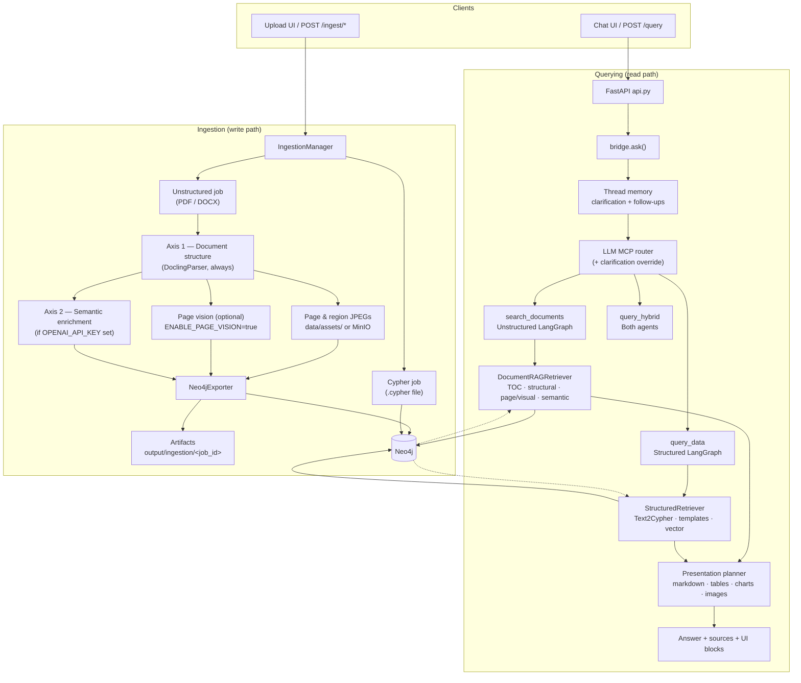
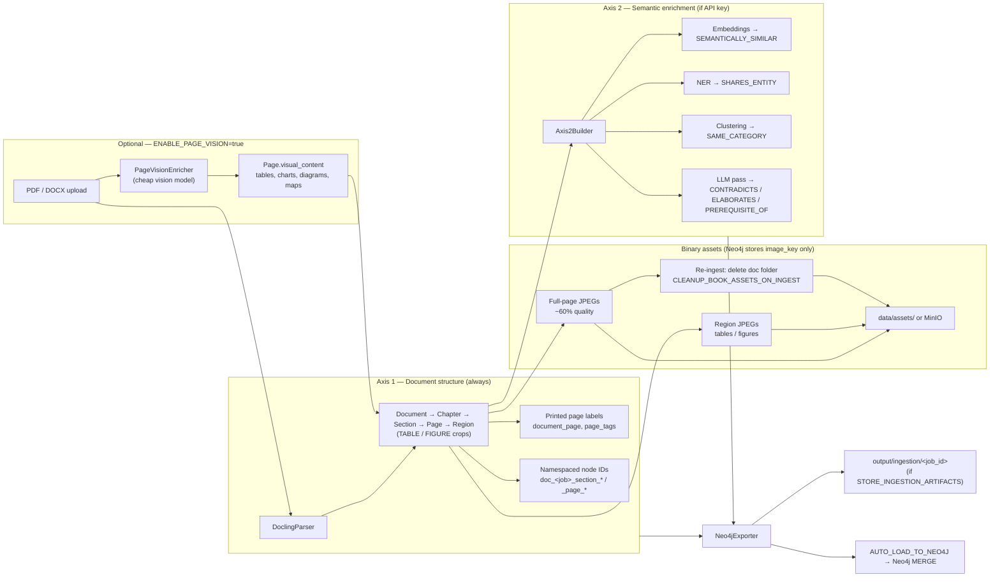
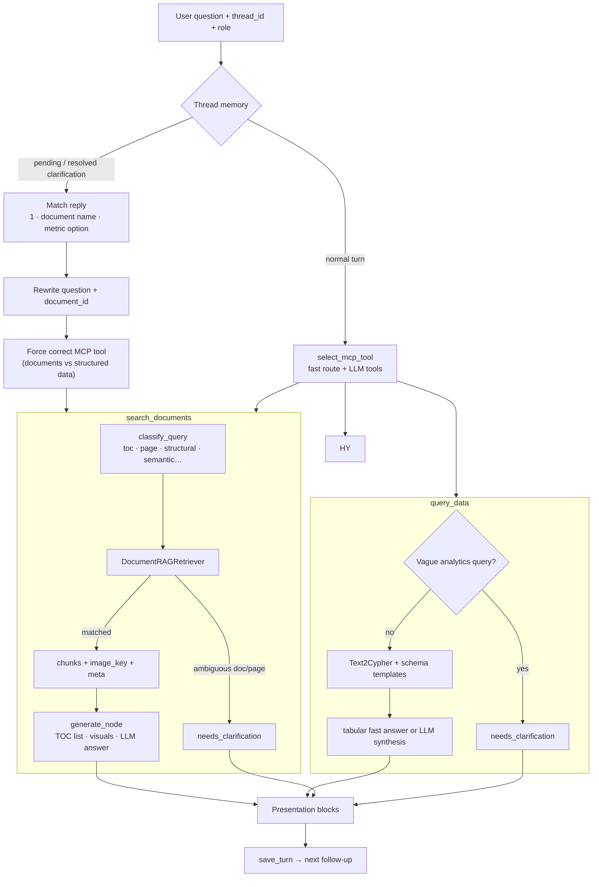

# Agentic Graph RAG

Ask questions over **documents** and **structured graph data** in one place. The app uses an LLM router to pick the right path:

- **Documents** — policies, PDFs, manuals (semantic + graph retrieval)
- **Structured data** — products, orders, customers (Text-to-Cypher on Neo4j)
- **Hybrid** — both when needed

Built with **FastAPI**, **Neo4j**, **LangGraph**, and **OpenAI**.

---

## What you get out of the box

| Feature | Description |
|---------|-------------|
| **Chat UI** | Ask questions in natural language |
| **Upload UI** | Ingest documents into the knowledge graph |
| **Northwind demo** | Sample business data loaded automatically on first Docker start |
| **Neo4j Browser** | Explore the graph visually |
| **Role-based access** | Control who can see which documents and data |

---

## Prerequisites

- [Docker Desktop](https://www.docker.com/products/docker-desktop/) (recommended)
- An [OpenAI API key](https://platform.openai.com/api-keys)

> **Tip:** Docker is the easiest way to run everything. A local Python setup is possible but requires Neo4j and more manual steps (see [Local development](#local-development-without-docker)).

---

## Quick start (Docker — recommended)

### 1. Clone the repo

```bash
git clone https://github.com/umerjavaidkh/agentic_graph_rag.git
cd agentic_graph_rag
```

### 2. Create your environment file

```bash
cp .env.example .env
```

Open `.env` and set your OpenAI key:

```env
OPENAI_API_KEY=sk-your-real-key-here
```

> **Important:** Do **not** set `NEO4J_URI` in `.env` when using Docker with the bundled Neo4j container. Docker handles that automatically.

### 3. Start the stack

**Slim image (~1 GB)** — chat + structured queries, no PDF upload:

```bash
docker compose up --build
```

**Full image (~8–10 GB)** — includes PDF ingest (Docling + PyTorch):

```bash
docker compose -f docker-compose.yml -f docker-compose.full.yml up --build
```

First build may take several minutes. Later rebuilds are fast (Docker caches layers).

### 4. Open the app

Wait until you see `Uvicorn running on http://0.0.0.0:8000` in the logs, then open:

| Page | URL |
|------|-----|
| **Chat** | http://localhost:8000/chat |
| **Upload** | http://localhost:8000/upload |
| **API docs** | http://localhost:8000/docs |
| **Health check** | http://localhost:8000/health |

---

## Using the chat

1. Go to http://localhost:8000/chat
2. Type a question and press **Send**

### Example questions

**Structured data (Northwind demo):**

```
Which customers ordered the most?
What are the top 5 best-selling products?
Show monthly order volume
```

**Documents (after you upload PDFs/DOCX):**

```
What is the whistleblowing procedure?
Summarize section 3 of the compliance manual
What must employees report to the compliance officer?
```

The app automatically routes your question to the right agent (`query_data`, `search_documents`, or `query_hybrid`).

---

## Uploading documents

Sample files for testing live in **`sample_data_to_test/`**:

```
sample_data_to_test/
├── unstructured/
│   ├── rag_document.pdf      # PDF for document RAG (full Docker image)
│   └── rag_document_2.pdf    # second PDF for multi-document / clarification tests
└── structured/
    └── northwind-data.cypher # structured graph load (products, orders, customers)
```

| File | Upload tab | Use for |
|------|------------|---------|
| `unstructured/*.pdf` | **Unstructured** | TOC, sections, page images, semantic search |
| `structured/northwind-data.cypher` | **Cypher** | Structured analytics (`query_data`) — requires `ALLOW_CYPHER_INGEST=true` and compliance/admin role |

1. Go to http://localhost:8000/upload
2. Choose a file from `sample_data_to_test/` (PDF requires the **full** Docker image)
3. Submit and wait for the ingestion job to finish
4. Ask questions about the document in **Chat**

Check job status via the API:

```bash
curl http://localhost:8000/ingest/jobs/{job_id}
```

Example upload from the repo root:

```bash
# Unstructured PDF (full stack)
curl -X POST http://localhost:8000/ingest/unstructured \
  -F "file=@sample_data_to_test/unstructured/rag_document.pdf"

# Structured Cypher (when ALLOW_CYPHER_INGEST=true)
curl -X POST http://localhost:8000/ingest/cypher \
  -F "file=@sample_data_to_test/structured/northwind-data.cypher" \
  -F "role=compliance_officer"
```

---

## Neo4j (graph database)

Neo4j runs in a separate container. It is **not** on the same port as the API.

| Purpose | URL / connection |
|---------|------------------|
| **Browser UI** | http://localhost:17474 |
| **Connect URL** (in Browser login) | `neo4j://localhost:17687` |
| **Username** | `neo4j` |
| **Password** | `password123` (default) |

> Ports **17474** and **17687** are used so Docker Neo4j does not clash with a local Neo4j on 7474 / 7687.

### Sample Cypher (Neo4j Browser)

```cypher
MATCH (c:Customer)-[:PURCHASED]->(o:Order)
RETURN c.companyName, count(o) AS orders
ORDER BY orders DESC
LIMIT 5
```

### Shell access

```bash
docker exec -it graphrag-neo4j cypher-shell -u neo4j -p password123
```

---

## Configuration

Copy `.env.example` → `.env`. Key settings:

| Variable | Required | Description |
|----------|----------|-------------|
| `OPENAI_API_KEY` | **Yes** | OpenAI API key for chat, routing, and embeddings |
| `NEO4J_USER` | No | Default: `neo4j` |
| `NEO4J_PASSWORD` | No | Default: `password123` |
| `CHAT_MODEL` | No | Default: `gpt-4o-mini` |
| `EMBEDDING_MODEL` | No | Default: `text-embedding-3-small` |
| `APP_PORT` | No | API port on host (default: `8000`) |
| `NEO4J_HTTP_PORT` | No | Neo4j Browser port (default: `17474`) |
| `NEO4J_BOLT_PORT` | No | Neo4j Bolt port (default: `17687`) |

### When to set `NEO4J_URI`

| How you run | `NEO4J_URI` in `.env` |
|-------------|------------------------|
| Docker + bundled Neo4j | **Leave unset** |
| Docker + Neo4j on your Mac | `bolt://host.docker.internal:7687` (see below) |
| API on Mac + Neo4j in Docker | `bolt://localhost:17687` |
| API on Mac + local Neo4j | `bolt://localhost:7687` |

---

## Docker commands cheat sheet

```bash
# Start (foreground — see logs)
docker compose up --build

# Start (background)
docker compose up -d --build

# Rebuild app only (after code changes — fast, uses cache)
docker compose up -d --build app

# Stop
docker compose down

# Stop and wipe database + uploaded assets
docker compose down -v

# View app logs
docker logs -f graphrag-app
```

---

## Docker variants

### Slim (default)

```bash
docker compose up --build
```

- ~1 GB app image
- Northwind structured queries + chat
- No PDF upload

### Full (PDF ingest)

```bash
docker compose -f docker-compose.yml -f docker-compose.full.yml up --build
```

- ~8–10 GB app image (Docling + PyTorch)
- PDF upload enabled

### External Neo4j (already running on your machine)

If you already have Neo4j on port `7687`:

```bash
# In .env set:
# NEO4J_PASSWORD=your-local-password

docker compose -f docker-compose.yml -f docker-compose.external-neo4j.yml up --build --scale neo4j=0
```

Load Northwind manually if the graph is empty: run `docker/northwind-docker.cypher` in Neo4j Browser.

---

## API quick reference

### Ask a question

```bash
curl -X POST http://localhost:8000/query \
  -H "Content-Type: application/json" \
  -d '{"question": "Which customers ordered the most?"}'
```

### Health check

```bash
curl http://localhost:8000/health
```

### Upload a document

```bash
curl -X POST http://localhost:8000/ingest/unstructured \
  -F "file=@sample_data_to_test/unstructured/rag_document.pdf"
```

See **`sample_data_to_test/`** for all sample PDFs and Cypher scripts.

Interactive API docs: http://localhost:8000/docs

---

## Architecture

### End-to-end overview



### How ingestion works



**Axis 1 (document structure)** is always built first from the Docling parser:

- Hierarchy: `Document → Chapter → Section → Page → Region` (tables/figures).
- **Page vision** (optional): when `ENABLE_PAGE_VISION=true`, selected PDF pages are sent to a cheap vision model; tables, charts, diagrams, maps, and shapes are stored as `Page.visual_content` for retrieval when normal text is missing or incomplete.
- **Page images**: JPEG (~60% quality) under `data/assets/` or MinIO; Neo4j stores `image_key` only. Re-ingest deletes that document’s asset folder first (`CLEANUP_BOOK_ASSETS_ON_INGEST`, default on). DB reset can wipe all assets (`CLEANUP_ASSETS_ON_DB_RESET`).

**Axis 2 (semantic enrichment)** runs automatically when the server has an OpenAI key configured (embeddings, entity links, clustering, optional LLM relationship pass).

The result is exported as Neo4j import artifacts in `output/ingestion/<job_id>` (when `STORE_INGESTION_ARTIFACTS=true`) and loaded into Neo4j automatically when `AUTO_LOAD_TO_NEO4J=true`.

**Structured ingest (separate path):** upload a `.cypher` file → statements run directly in Neo4j (e.g. Northwind demo on first Docker start).

### How querying works



1. **Chat / API** receives the question, optional `thread_id`, and user role (RBAC).
2. **Thread memory** resolves short follow-ups and clarification replies (e.g. pick a document for TOC, switch from Stratec to Go.Data, pick a sales metric).
3. **LLM MCP router** picks `search_documents`, `query_data`, or `query_hybrid` — unless a clarification reply forces the correct tool.
4. **Unstructured agent** classifies intent (TOC, page/images, structural, semantic), retrieves from Neo4j, and generates an answer (with clarification when multiple documents match).
5. **Structured agent** runs Text2Cypher (or deterministic templates) against whatever graph schema is loaded — not hard-coded to Northwind.
6. **Presentation planner** builds markdown, tables, charts, and image blocks for the chat UI.

### Neo4j graph contents

| Source | Main labels | Example relationships |
|--------|-------------|------------------------|
| Unstructured ingest | `Document`, `Chapter`, `Section`, `Page`, `Region` | `CONTAINS`, Axis-2 semantic edges |
| Structured ingest | `Product`, `Order`, `Customer`, … (any schema) | Domain relationships from Cypher |
| RBAC | `User`, `Role`, permissions | Document/data access control |

### Ingestion ↔ query config

| Variable | Effect |
|----------|--------|
| `ENABLE_PAGE_VISION` | Vision text on selected PDF pages |
| `ENABLE_PAGE_IMAGES` | Full-page JPEG extraction |
| `CLEANUP_BOOK_ASSETS_ON_INGEST` | Delete prior `data/assets/<doc>/` before re-ingest |
| `CLEANUP_ASSETS_ON_DB_RESET` | Wipe all assets on DB reset |
| `AUTO_LOAD_TO_NEO4J` | Load graph after export |
| `STORE_INGESTION_ARTIFACTS` | Write `output/ingestion/<job_id>` |
| `OPENAI_API_KEY` | Chat, routing, embeddings; enables Axis 2 and optional vision |

---

## Project structure

```
agentic_graph_rag/
├── sample_data_to_test/    # Sample PDFs + Cypher for upload/ingest tests
│   ├── unstructured/       # rag_document.pdf, rag_document_2.pdf
│   └── structured/         # northwind-data.cypher
├── src/
│   ├── api.py              # FastAPI app + web UI routes
│   ├── routing.py          # LLM query router
│   ├── structured/         # Text-to-Cypher + Northwind queries
│   ├── unstructured/       # Document retrieval + RAG
│   ├── ingestion/          # Upload pipeline
│   └── auth/               # Role-based access control
├── docker-compose.yml      # App + Neo4j
├── Dockerfile              # Slim image
├── Dockerfile.full         # Full image (PDF)
├── scripts/                # Docker entrypoint + demo data
└── .env.example            # Environment template
```

---

## Troubleshooting

### Chat/upload not loading (connection refused on :8000)

Check if the app container is running:

```bash
docker ps --filter name=graphrag
docker logs graphrag-app --tail 50
```

If the app exited, common causes:

- Missing or placeholder `OPENAI_API_KEY` in `.env`
- `NEO4J_URI=bolt://localhost:7687` in `.env` while using Docker — **remove that line**

Restart:

```bash
docker compose up -d app
```

### Neo4j Browser: "Connection to instance failed"

Use the **mapped** port, not the default Neo4j port:

| Wrong | Correct |
|-------|---------|
| `bolt://localhost:7687` | `neo4j://localhost:17687` |

Browser URL: http://localhost:17474

### Container name already in use

```bash
docker rm graphrag-neo4j graphrag-app
docker compose up -d
```

### Rebuild takes forever

Only rebuild the app after code changes:

```bash
docker compose up -d --build app
```

Requirements/Dockerfile changes trigger a full pip install again.

### Access denied on structured queries

The demo uses role-based access. In Chat, try role `admin` in the sidebar, or check RBAC setup in Neo4j (`src/auth/rbac_schema.cypher`).

---

## Local development (without Docker)

1. Install **Python 3.11+** and **Neo4j 5.x**
2. Create a virtualenv and install dependencies:

```bash
python -m venv venv
source venv/bin/activate   # Windows: venv\Scripts\activate
pip install -r requirements.txt
```

3. Configure `.env`:

```env
OPENAI_API_KEY=sk-your-key
NEO4J_URI=bolt://localhost:7687
NEO4J_USER=neo4j
NEO4J_PASSWORD=your-password
```

4. Start Neo4j, load demo data if needed, then run the API:

```bash
uvicorn src.api:app --reload --host 0.0.0.0 --port 8000
```

---

## Security notes

- **Never commit `.env`** — it is gitignored; use `.env.example` as a template
- `ALLOW_CYPHER_INGEST` and `ALLOW_DB_RESET` are dangerous in production — keep them `false` unless you know what you are doing
- Rotate your OpenAI key if it was ever exposed

---

## License

Private repository — use and share according to your own terms.

---

## Need help?

1. Check logs: `docker logs -f graphrag-app`
2. Verify health: http://localhost:8000/health
3. Verify Neo4j: http://localhost:17474 with `neo4j://localhost:17687`

For a walkthrough, see the project video (link TBD).
