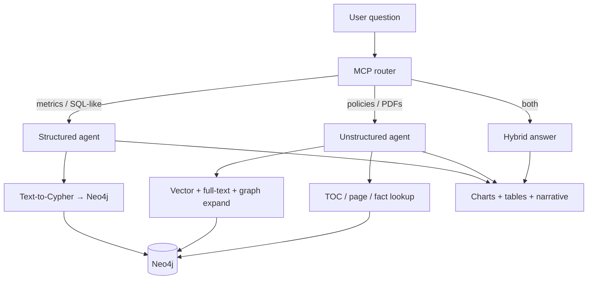

# Agentic GraphRAG

**One Neo4j graph. Two knowledge modes. Answers that flat RAG cannot reliably give.**

Agentic GraphRAG is a production-oriented **Graph RAG** stack that keeps **structured business data** and **unstructured documents** in the same graph database, then routes each question to the right retrieval strategy—or combines both. You get SQL-grade analytics on Northwind-style entities *and* multi-hop reasoning over WHO reports, policies, and manuals—without maintaining separate vector DBs, ETL pipelines, and ad-hoc orchestration glue.

Built with **Neo4j · FastAPI · LangGraph · OpenAI**.

---

## Why this is different

| Typical flat RAG | Agentic GraphRAG |
|------------------|------------------|
| One chunk index for everything | **Dedicated graphs** for tables vs. documents |
| Similarity search only | **Cypher** for metrics + **hybrid retrieval** for PDFs |
| Weak on counts, joins, time series | **Aggregations, rankings, charts** from live Neo4j |
| Loses document structure | **Hierarchy**: Document → Chapter → Section → Page → Region |
| Single-hop Q&A | **Multi-hop** paths across entities, networks, and field stories |
| Guesses when context is missing | **Eval suite** includes anti-hallucination and empty-result cases |

**Unique in practice:** the same user session can ask *“Top 5 products by revenue in 1997”* (structured) and *“Which field epidemiology network deployed fellows to Greece and Kosovo?”* (unstructured, 2–3 hop)—with an **LLM MCP router** choosing `query_data` vs. `search_documents`, RBAC enforcing who sees what, and the chat UI rendering **tables, bar/line/doughnut charts**, or narrative answers as appropriate.

---

## What it does



| Mode | Best for | Examples |
|------|----------|----------|
| **Structured** | Counts, filters, rankings, time series, BI | *“Monthly order count in 1997”* · *“Revenue share by category”* |
| **Unstructured** | Facts, relationships, timelines, synthesis over PDFs | *“ISBN of the annual report”* · *“Network that deployed fellows to Malta and Moldova”* |
| **Hybrid** | Incidents + policy context in one answer | *“Show compliance incidents and summarize related policy guidance”* |

**Unstructured retrieval is not “vector-only.”** It layers semantic search, lexical match, graph expansion from extracted entities, structural TOC/page fetch, and phrase-based fact lookup (URLs, licenses, abbreviations)—so complex questions anchor on the right section before synthesis.

**Structured retrieval is not “text-to-SQL on CSV.”** It uses your **Neo4j schema** (Northwind demo or your own Cypher ingest), schema-aware repair, multistep plans for hard questions, and automatic chart selection (bar, horizontal bar, line, pie/doughnut).

---

## Complex questions this stack is built for

Use the bundled **30-case eval** (`python3 scripts/run_rag_eval.py --suite all`) or try these in chat:

| Complexity | Structured (Northwind · `regular_001` / `regular_office`) | Unstructured (Go.Data · `public_001`) |
|------------|-----------------------------------------------------------|----------------------------------------|
| **Lookup** | Which supplier provides Chai? | What is the electronic version ISBN of the Go.Data annual report 2021? |
| **Aggregation** | How many products exist in each category? | How many countries and territories were supported during 2020–2021? |
| **Multi-hop** | Which customers purchased products in the Seafood category? | Which network deployed alumni to Greece, Malta, Moldova, and Kosovo? |
| **Temporal** | Show monthly order count in 1997. | Which deployment came first: Cox's Bazar or Kasese, Uganda? |
| **Compare / synthesize** | Revenue share by category (doughnut). | Contrast proximity tracing tools vs. Go.Data as categorized by WHO. |
| **Anti-hallucination** | Which categories have never appeared in an order? | Which Silicon Valley firm wrote the Go.Data iOS app? *(should deny—not invent)* |

---

## What's new (June 2026)

| Change | Details |
|--------|---------|
| **Lightweight PDF parser** | PyMuPDF + pdfplumber. ~1 GB image, no Java. |
| **Image storage removed** | No binary JPEGs. Visual content stored as `Page.visual_content` text in Neo4j. |
| **Document versioning** | Immutable `DocRevision` per upload. Same file → skipped. Changed file → new revision, old one expired. |
| **Scalable ingestion** | Redis + RQ workers. Durable job state, auto-retry, per-doc lock, candidate-pair cap. Falls back to in-process `BackgroundTasks` when `REDIS_URL` is unset. |
| **Parallel Axis 2** | NER and LLM relationship passes run in parallel thread pools (8 NER / 6 LLM calls concurrently). |
| **Batched Neo4j writes** | `UNWIND` grouped by label/rel type. Default chunk 2 000 nodes. |
| **Bulk upload UI** | Drop multiple PDFs at once; each gets its own live status card on `/upload`. |
| **New API endpoints** | `GET /ingest/jobs` · `GET /ingest/queue/status`. No more 409 on concurrent uploads. |

---

## Tech stack

| Layer | Technology |
|-------|------------|
| Graph database | Neo4j 5.x |
| AI orchestration | LangGraph |
| API | FastAPI + Uvicorn |
| LLM / Embeddings | OpenAI (gpt-4o-mini, text-embedding-3-small) |
| PDF parsing | PyMuPDF + pdfplumber |
| Job queue | Redis + RQ *(optional — in-process fallback when unset)* |
| Containers | Docker / Docker Compose |

---

## Quick start

```bash
git clone https://github.com/umerjavaidkh/agentic_graph_rag.git
cd agentic_graph_rag
cp .env.example .env          # add OPENAI_API_KEY
docker compose up --build
```

Open:

| Page | URL |
|------|-----|
| **Chat** | http://localhost:8000/chat |
| **Upload** | http://localhost:8000/upload |
| **API docs** | http://localhost:8000/docs |
| **Health** | http://localhost:8000/health |

> Do **not** set `NEO4J_URI` in `.env` when using the bundled Docker Neo4j — it is wired automatically.

### Enable Redis workers (parallel ingestion)

Add to `.env`:

```env
REDIS_URL=redis://redis:6379/0
```

Then:

```bash
docker compose up --build              # starts Neo4j + Redis + API + 1 worker
docker compose up --scale worker=3    # scale to 3 parallel workers
```

Without `REDIS_URL`, jobs run inside FastAPI via `BackgroundTasks` — fine for local dev.

---

## Uploading documents

Go to **http://localhost:8000/upload**:

- **Drop multiple PDFs** onto the drop zone — they are submitted concurrently.
- Each file appears as a live job card with status, dispatch mode (`WORKER` / `IN-PROCESS`), version, and expandable logs.
- The **queue status bar** shows Redis connectivity, queue depth, and failed job count.

Or via `curl`:

```bash
# Single PDF
curl -X POST http://localhost:8000/ingest/unstructured \
  -F "file=@sample_data_to_test/unstructured/rag_document.pdf" \
  -F "doc_key=rag-document"

# Cypher data (requires ALLOW_CYPHER_INGEST=true)
curl -X POST http://localhost:8000/ingest/cypher \
  -F "file=@sample_data_to_test/structured/northwind-data.cypher" \
  -F "role=compliance_officer"
```

`doc_key` controls versioning: same key + same file → skipped; same key + changed file → new revision.

---

## Try it in chat

| Track | Prerequisite | User ID | Role |
|-------|--------------|---------|------|
| **Structured** | Upload `sample_data_to_test/structured/northwind-data.cypher` (Cypher tab; `ALLOW_CYPHER_INGEST=true`, `CYPHER_INGEST_SKIP_GENAI=true`) | `regular_001` | `regular_office` |
| **Unstructured** | Upload Go.Data (or sample) PDF on `/upload` | `public_001` | `public` |
| **Hybrid** | Both loaded | `compliance_001` | `compliance_officer` |

**Structured quick checks:**
```
Which customers ordered the most?
Top 5 products by sales revenue in 1997?
```

**Unstructured quick checks:**
```
List all the table of contents from the Go.Data document.
What is the URL for the Go.Data Community of Practice portal?
```

**Hybrid:**
```
Show compliance incidents and summarize the related policy guidance.
```

### Structured evaluation set (10 questions)

Use these to exercise retrieval depth, chart types, and hallucination resistance. In chat, set **User ID** to `regular_001` and **role** to `regular_office` (not `regular`).

| # | Level | Question | Expected UI |
|---|-------|----------|-------------|
| 1 | Simple lookup | Which supplier provides Chai? | Table or short text (no chart) |
| 2 | Filter / rank | What are the top 5 most expensive products? | **Bar** chart + table |
| 3 | Aggregation | How many products exist in each category? | **Bar** chart + table |
| 4 | Share / part-to-whole | Show the revenue share by product category in 1997. | **Doughnut** + table |
| 5 | Time series | Show monthly order count in 1997. | **Line** chart + table |
| 6 | Many categories | What are the top 12 customers by total order count? | **Horizontal bar** + table |
| 7 | Multi-hop | Which customers purchased products in the Seafood category? | Table (+ narrative) |
| 8 | Business ranking | What are the top 10 best-selling products by order count? | **Bar** or horizontal bar + table |
| 9 | Hallucination test | Which categories have never appeared in an order? | Table only (may be empty — must not invent rows) |
| 10 | Advanced BI | Which supplier's products appear in the greatest number of orders? | **Bar** chart + table |

Copy-paste list:

```
1. Which supplier provides Chai?
2. What are the top 5 most expensive products?
3. How many products exist in each category?
4. Show the revenue share by product category in 1997.
5. Show monthly order count in 1997.
6. What are the top 12 customers by total order count?
7. Which customers purchased products in the Seafood category?
8. What are the top 10 best-selling products by order count?
9. Which categories have never appeared in an order?
10. Which supplier's products appear in the greatest number of orders?
```

Chart type is chosen automatically from the question and result shape (bar, horizontal bar, line, pie/doughnut). Hard-refresh `/chat` after deploy so Chart.js loads.

### Combined RAG eval (30 questions: 20 document + 10 structured)

Runnable smoke suite with heuristic checks (routing, non-empty answers, soft keywords, chart types, anti-hallucination hints). Not a substitute for human golden labels — use it to catch regressions after ingest or deploy changes. Current status on the reference fixtures: **30/30 pass**.

> **Corpus-agnostic by design.** All document-specific expectations (ISBN, licence, language names, network acronyms, etc.) live **only** in the eval JSON. The retriever and router contain **no per-document or per-topic keywords** — document selection uses query-derived anchors plus vector-majority resolution, so swapping in a different PDF needs no code changes.

| Suite | File | User | Prerequisite |
|-------|------|------|--------------|
| Document | `eval/document_rag_suite.json` | `public_001` | Target PDF ingested (suite keywords are fixture-specific) |
| Structured (Northwind) | `eval/structured_rag_suite.json` | `regular_001` + role `regular_office` | `northwind-data.cypher` loaded |

```bash
# All 30 cases (default) — smoke + routing + keyword/chart checks
python3 scripts/run_rag_eval.py --suite all

python3 scripts/run_rag_eval.py --suite structured   # 10 Northwind
python3 scripts/run_rag_eval.py --suite document     # 20 Go.Data

python3 scripts/run_rag_eval.py --id nw_04 --output /tmp/rag_eval.json
pytest tests/test_rag_eval_validators.py -q   # offline validators
```

Set `EVAL_BASE_URL` (default `http://localhost:8000`) and `EVAL_TIMEOUT` (default `180`) for slow LLM calls. Each case uses a fresh `thread_id`.

---

## Architecture

**Query path**

```
User Query → MCP Router (routing.py)
                 ├─ Structured Agent → Text-to-Cypher → Neo4j → charts/tables
                 ├─ Unstructured Agent → hybrid retrieval → Neo4j → narrative + sources
                 └─ Hybrid (compliance role) → both paths → merged answer
```

**Unstructured retrieval modes** (selected per question): vector similarity · full-text · graph expand from NER · TOC structural fetch · page-by-number · phrase/fact lookup (URLs, licenses).

**Ingestion write path:**

```
PDF → LightPdfParser
        │
        ├── Axis 1: Document → Chapter → Section → Page → Region
        ├── Page vision (optional, ENABLE_PAGE_VISION=true)
        └── Axis 2: Embeddings · NER · Clustering · LLM relationship pass
                      (parallel thread pools)
              │
              └── Neo4jExporter (UNWIND batched writes) → Neo4j
```

**With Redis workers:**

```
POST /ingest  →  API  →  Redis queue
                              │
                    ┌─────────┴─────────┐
                 Worker 1           Worker N
                    │                   │
             per-doc Redis lock (same doc serialised, different docs parallel)
             parse → Axis 2 → batched Neo4j writes → update job in Redis
                              │
GET /ingest/jobs/{id}  →  reads from Redis  →  200
```

---

## Configuration

Copy `.env.example` → `.env`. Key variables:

### Core

| Variable | Default | Description |
|----------|---------|-------------|
| `OPENAI_API_KEY` | **required** | LLM, embeddings, routing |
| `NEO4J_USER` | `neo4j` | Neo4j username |
| `NEO4J_PASSWORD` | `password123` | Neo4j password |
| `CHAT_MODEL` | `gpt-4o-mini` | Document RAG synthesis; default for other stages |
| `STRUCTURED_MODEL` | *(CHAT_MODEL)* | Text-to-Cypher + structured answers |
| `ROUTING_MODEL` | *(CHAT_MODEL)* | MCP routing (`search_documents` vs `query_data`) |
| `AXIS2_MODEL` | *(CHAT_MODEL)* | Ingestion NER + relationship LLM pass |
| `EMBEDDING_MODEL` | `text-embedding-3-small` | Retrieval + ingest embeddings |
| `VISION_MODEL` | `gpt-4o-mini` | Page vision (`ENABLE_PAGE_VISION=true`) |

| `APP_PORT` | `8000` | API port |

Active model resolution: `GET /config/models`

### Ingestion & scalability

| Variable | Default | Description |
|----------|---------|-------------|
| `REDIS_URL` | *(unset = in-process)* | Set to `redis://redis:6379/0` for workers |
| `INGEST_QUEUE_NAME` | `ingest` | RQ queue name |
| `AXIS2_NER_CONCURRENCY` | `8` | Parallel NER calls per doc |
| `AXIS2_LLM_PAIR_CONCURRENCY` | `6` | Parallel LLM relationship calls per doc |
| `AXIS2_MAX_LLM_PAIRS` | `300` | Cap on candidate pairs sent to LLM |
| `NEO4J_WRITE_BATCH` | `2000` | UNWIND chunk size for bulk writes |
| `DOC_SKIP_DUPLICATE_HASH` | `true` | Skip ingest when same file already active |
| `DOC_VERSION_RETAIN_METADATA` | `true` | Keep expired `DocRevision` nodes for audit |
| `ENABLE_PAGE_VISION` | `false` | Vision model descriptions for PDF pages |
| `ALLOW_CYPHER_INGEST` | `false` | Enable `.cypher` file upload endpoint |
| `ALLOW_DB_RESET` | `false` | Enable `/admin/reset-neo4j` |

### NEO4J_URI — when to set it

| Setup | Value |
|-------|-------|
| Docker + bundled Neo4j | **Leave unset** |
| Docker + Neo4j on your Mac | `bolt://host.docker.internal:7687` |
| API on Mac + Neo4j in Docker | `bolt://localhost:17687` |
| API on Mac + local Neo4j | `bolt://localhost:7687` |

---

## API reference

```bash
# Query
curl -X POST http://localhost:8000/query \
  -H "Content-Type: application/json" \
  -d '{"question": "Which customers ordered the most?", "user_id": "regular_001", "role": "regular_office"}'

# Upload PDF
curl -X POST http://localhost:8000/ingest/unstructured \
  -F "file=@doc.pdf" -F "doc_key=my-doc"

# Job status
curl http://localhost:8000/ingest/jobs/{job_id}
curl http://localhost:8000/ingest/jobs?limit=20
curl http://localhost:8000/ingest/queue/status

# Health / active models
curl http://localhost:8000/health
curl http://localhost:8000/config/models
```

Response fields from `/ingest/jobs/{id}`: `status`, `dispatch` (`worker` / `background_task`), `logical_doc_id`, `revision_id`, `version_number`, `skipped_duplicate`, `logs[]`, `error`.

---

## RBAC (demo users)

| User | Documents | Structured DB |
|------|-----------|---------------|
| `public_001` | ✅ | ❌ |
| `regular_001` | ❌ | ✅ |
| `compliance_001` | ✅ | ✅ |
| `admin_001` | ✅ | ✅ |

---

## Neo4j

| Purpose | Value |
|---------|-------|
| Browser | http://localhost:17474 |
| Bolt URL (in Browser login) | `neo4j://localhost:17687` |
| Username / Password | `neo4j` / `password123` |

Ports 17474 / 17687 avoid clashing with a local Neo4j on 7474 / 7687.

```bash
# Shell access
docker exec -it graphrag-neo4j cypher-shell -u neo4j -p password123
```

---

## Project structure

```
agentic_graph_rag/
├── sample_data_to_test/
│   ├── unstructured/          # rag_document.pdf, rag_document_2.pdf
│   └── structured/            # northwind-data.cypher
├── src/
│   ├── api.py                 # FastAPI routes, dispatch, job list, queue status
│   ├── config/settings.py     # All env-var settings
│   ├── ingestion/
│   │   ├── service.py         # IngestionManager (store-backed, per-doc lock)
│   │   ├── job_store.py       # RedisJobStore / InMemoryJobStore
│   │   ├── queue.py           # RQ queue helpers
│   │   ├── tasks.py           # run_ingest_job() — RQ worker callable
│   │   └── models.py          # IngestionStatus enum
│   ├── document/
│   │   ├── parser.py          # LightPdfParser (PyMuPDF + pdfplumber)
│   │   ├── page_vision.py     # Optional vision enrichment
│   │   └── versioning.py      # Logical doc ID, revision plans, hashing
│   ├── exporter/exporter.py   # Neo4jExporter — UNWIND batched writes
│   ├── semantic/axis2.py      # Axis 2 (parallel NER + LLM relationship pass)
│   ├── retrieval/
│   │   ├── unstructured/      # DocumentRAGRetriever, TOC helpers
│   │   └── structured/        # Text-to-Cypher + schema repair
│   ├── graph/                 # Neo4j constants, lifecycle helpers
│   ├── presentation/          # UI blocks (markdown, tables, charts)
│   ├── conversation/          # Thread memory + clarification
│   ├── auth/                  # RBAC (roles, knowledge areas)
│   └── prompts/               # LLM prompts
├── eval/
│   ├── document_rag_suite.json    # 20 Go.Data document questions
│   ├── structured_rag_suite.json  # 10 Northwind questions
│   └── validators.py
├── scripts/run_rag_eval.py        # 30-case smoke eval against /query
├── tests/
│   ├── test_scalable_pipeline_unit.py
│   ├── test_document_versioning_unit.py
│   ├── test_toc_retrieval_unit.py
│   └── test_rag_eval_validators.py
├── docker-compose.yml         # Neo4j + Redis + API + worker
├── Dockerfile
└── .env.example
```

---

## Troubleshooting

**App not loading (port 8000 refused)**
```bash
docker ps --filter name=graphrag
docker logs graphrag-app --tail 50
# Common cause: missing OPENAI_API_KEY, or NEO4J_URI set to localhost in .env
docker compose up -d app
```

**Neo4j Browser: "Connection failed"** — use `neo4j://localhost:17687`, not `localhost:7687`.

**Worker not picking up jobs**
```bash
docker ps --filter name=worker
docker logs $(docker ps --filter name=worker -q | head -1) --tail 30
docker exec graphrag-redis redis-cli ping        # should return PONG
curl http://localhost:8000/ingest/queue/status   # check failed_jobs[]
```

**Job status lost after restart** — set `REDIS_URL` for durable storage; without it state lives only in the API process.

**Access denied on structured queries** — structured data needs `regular_001`, `compliance_001`, or `admin_001`. PDF questions need `public_001`, `compliance_001`, or `admin_001`.

**Rebuild slow** — only rebuild the changed service:
```bash
docker compose up -d --build app
```

---

## Local development (without Docker)

```bash
python -m venv venv && source venv/bin/activate
pip install -r requirements.txt
# .env: set OPENAI_API_KEY, NEO4J_URI=bolt://localhost:7687, NEO4J_PASSWORD
uvicorn src.api:app --reload --host 0.0.0.0 --port 8000
```

---

## Demo

| Ingestion | Unstructured | Structured |
| :---: | :---: | :---: |
| [](https://www.youtube.com/watch?v=2983DqSe0GM) | [](https://www.youtube.com/watch?v=s3Eceo20Eq4) | [](https://www.youtube.com/watch?v=XvigWQ5mB1g) |

**Medium article:** [Agentic Graph RAG — architecture and walkthrough](https://medium.com/p/0ee1f6baae26)

---

## Security

- Never commit `.env` — it is gitignored
- `ALLOW_CYPHER_INGEST` and `ALLOW_DB_RESET` are dangerous in production — keep them `false`
- Rotate your OpenAI key if it was ever exposed
