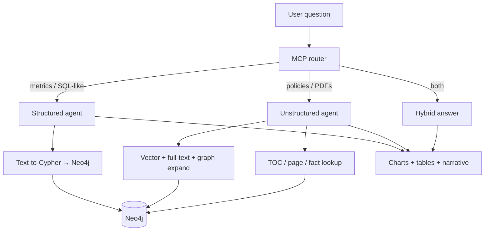

# Agentic GraphRAG

[](LICENSE)

**One Neo4j graph. Two knowledge modes. Answers that flat RAG cannot reliably give.**

**Every layer is a plug-in point, not a fixed pipeline.** Parsing, ingestion, and retrieval are each built behind a real interface — `DocumentParser`, `ModelProvider`/`BlobStore`/`VectorStore`, `StructuredStrategy`/`UnstructuredStrategy` — so you can bring your own PDF parser, embedding/LLM provider, storage backend, or retrieval strategy and register it, without forking or touching existing code. Retrieval alone already ships 5 unstructured + 2 structured strategies resolved by name at runtime; parsing ships 2 (a fast default and a table-aware variant that fixes real over-segmentation bugs found on live SEC filings). See [Pluggable by design](#pluggable-by-design) below for the exact seams and how to add your own.

Agentic GraphRAG keeps **structured business data** and **unstructured documents** in the same graph database, then routes each question to the right retrieval strategy — or combines both. SQL-grade analytics *and* multi-hop reasoning over PDFs/DOCX, without separate vector DBs, ETL pipelines, or ad-hoc orchestration glue.

It brings **your own** Neo4j schema and **your own** documents: the query router reads the live graph schema at runtime rather than hardcoding a demo domain, so it isn't tied to the bundled Northwind + Go.Data sample data used below.

Built with **Neo4j · FastAPI · LangGraph**. Chat/synthesis runs on **OpenAI, Anthropic (Claude), or Gemini** — pick with `MODEL_PROVIDER`; embeddings always use OpenAI.

## Demo

**Ingestion** — drop PDFs in the bulk-upload UI, watch them become a versioned Neo4j knowledge graph.

[](https://youtu.be/K4XIat6xpEw)

**Retrieval + eval** — the eval suite answered live in the chat UI, each case validated with an on-screen PASS/FAIL banner (recorded run: 30/30; the suite has since grown to 40 cases, currently 40/40).

[](https://youtu.be/7011-xkI1RI)

## Why this is different

| Typical flat RAG | Agentic GraphRAG |
|------------------|------------------|
| One chunk index for everything | Dedicated graphs for tables vs. documents |
| Similarity search only | Cypher for metrics + hybrid retrieval for PDFs |
| Weak on counts, joins, time series | Aggregations, rankings, charts from live Neo4j |
| Loses document structure | Hierarchy: Document → Chapter → Section → Page → Region |
| Guesses when context is missing | Eval suite covers anti-hallucination and empty-result cases |

The same user session can ask *"Top 5 products by revenue in 1997"* (structured) and *"Which network deployed fellows to Greece and Kosovo?"* (unstructured, multi-hop) — an LLM router chooses `query_data` vs. `search_documents`, RBAC enforces who sees what, and the chat UI renders tables, charts, or narrative as appropriate.

### Pluggable by design

Most RAG repos hardcode one parser, one embedding provider, and one retrieval path. Here every one of those is a named implementation of a real interface, resolved at runtime — not a hypothetical "you could refactor this later." These are the actual seams in the code today:

| Seam | Interface | Registered implementations | Add your own |
|------|-----------|------------------------------|---------------|
| **Parsing** | `DocumentParser` Protocol — [`src/document/parser_base.py`](src/document/parser_base.py) | `LightPdfParser` (`.pdf:light`), `TableAwarePdfParser` (`.pdf:table-aware`) — [`src/document/parser_registry.py`](src/document/parser_registry.py) | Implement `parse(source) -> (nodes, edges)`, call `register_parser(".pdf:yourname", YourParser)` |
| **Retrieval (unstructured)** | `UnstructuredStrategy` Protocol — [`src/retrieval/unstructured/strategies/base.py`](src/retrieval/unstructured/strategies/base.py) | `structural_box_list`, `subsection_tree`, `structural_toc`, `structural_page`, `graph_rag_hybrid` | Implement `retrieve(...)`, call `register_unstructured("yourname", factory)` |
| **Retrieval (structured)** | `StructuredStrategy` Protocol — [`src/retrieval/structured/strategies/base.py`](src/retrieval/structured/strategies/base.py) | `text2cypher`, `multistep` | Implement `retrieve(...)`, call `register_structured("yourname", factory)` |
| **LLM (chat/synthesis)** | `ModelProvider` ABC — [`src/model_providers/base.py`](src/model_providers/base.py) | `OpenAIProvider`, `AnthropicProvider`, `GeminiProvider` — pick with `MODEL_PROVIDER` (`get_chat_provider()` in [`src/model_providers/factory.py`](src/model_providers/factory.py)) | Implement `chat_completion`/`chat_completion_stream`, register in `get_model_provider()` |
| **Embeddings** | same `ModelProvider` ABC | `OpenAIProvider` only — always used regardless of `MODEL_PROVIDER` (Anthropic has no embeddings API; Neo4j's vector index has a fixed dimension) — see `get_embedding_provider()` | Swapping embedding provider/dimension needs a matching vector-index rebuild; not currently wired up |
| **Blob storage** | `BlobStore` ABC — [`src/storage/blob/base.py`](src/storage/blob/base.py) | Local filesystem, MinIO | Implement `put`/`get`/`delete`/`exists`, wire into `get_blob_store()` |
| **Vector storage** | `VectorStore` ABC — [`src/storage/vector/base.py`](src/storage/vector/base.py) | In-memory, Qdrant | Implement `upsert`/`query`/`delete`, wire into `get_vector_store()` |

Two consequences worth calling out:

- **Parsing bugs get fixed as new strategies, not patches on the default.** `TableAwarePdfParser` was added after real ingestion-quality regressions surfaced on live SEC filings (table rows misread as headings, repeated running headers counted as chapters) — it's a second, independently-selectable implementation (`PDF_PARSER_BACKEND=table-aware`), A/B-compared against the default on the same documents before being trusted, not a silent behavior change to everyone's pipeline.
- **Ingestion quality is measured, not assumed.** [`scripts/validate_ingestion.py`](scripts/validate_ingestion.py) and `GET /ingest/quality/{doc_id}` compute a cheap, LLM-free per-document report (text/NER/embedding coverage, orphan nodes, page continuity) straight from the ingested graph — the same tool that caught the regressions above, and how any new parser/provider gets evaluated before it's recommended.
- **Schema-driven, not domain-hardcoded.** The query router reads the live Neo4j schema (`structured_entity_summary()`) at runtime instead of hardcoding a demo domain — bring your own graph and the routing adapts.

## Architecture


```mermaid
flowchart TB
  Q[User question] --> R[MCP router]
  R -->|metrics / SQL-like| S[Structured agent]
  R -->|policies / PDFs| U[Unstructured agent]
  R -->|both| H[Hybrid answer]
  S --> C[Text-to-Cypher → Neo4j]
  U --> V[Vector + full-text + graph expand]
  U --> T[TOC / page / fact lookup]
  C --> N[(Neo4j)]
  V --> N
  T --> N
  S --> UI[Charts + tables + narrative]
  U --> UI
  H --> UI
```

Full write-up (query path, ingestion pipeline, multi-tenancy, audit log, project structure): **[docs/ARCHITECTURE.md](docs/ARCHITECTURE.md)**.

## Quick start

```bash
git clone https://github.com/umerjavaidkh/agentic_graph_rag.git
cd agentic_graph_rag
cp .env.example .env          # add OPENAI_API_KEY (always required — embeddings)
# Optional: MODEL_PROVIDER=anthropic|gemini for chat/synthesis + the matching
# ANTHROPIC_API_KEY/GOOGLE_API_KEY — defaults to openai for chat too if unset.
docker compose up --build
```

| Page | URL |
|------|-----|
| **Chat** | http://localhost:8000/chat |
| **Upload** | http://localhost:8000/upload |
| **Feedback + audit monitor** | http://localhost:8000/feedback |
| **API docs** | http://localhost:8000/docs |
| **Health** | http://localhost:8000/health |

> Do **not** set `NEO4J_URI` in `.env` when using the bundled Docker Neo4j — it is wired automatically.

Try it in `/chat` with the dev sidebar (`master` branch, no sign-in required):

| Track | User ID | Role | Try asking |
|-------|---------|------|------------|
| Structured (needs Northwind sample loaded) | `regular_001` | `regular_office` | *Top 5 products by sales revenue in 1997?* |
| Unstructured (needs a PDF ingested) | `public_001` | `public` | *List the table of contents from the document.* |
| Hybrid | `compliance_001` | `compliance_officer` | *Show compliance incidents and summarize related policy.* |
| Ingestion | `admin_001` | `admin` | use `/upload` |

Load the sample data via `/upload` (drag a PDF from `sample_data_to_test/unstructured/`, or upload `sample_data_to_test/structured/northwind-data.cypher` with `ALLOW_CYPHER_INGEST=true`).

## Tech stack

| Layer | Technology |
|-------|------------|
| Graph database | Neo4j 5.x |
| AI orchestration | LangGraph |
| API | FastAPI + Uvicorn |
| LLM (chat/synthesis) | OpenAI, Anthropic, or Gemini (`MODEL_PROVIDER`; default gpt-4o-mini) |
| Embeddings | OpenAI only, always (text-embedding-3-small) |
| PDF parsing | PyMuPDF + pdfplumber |
| Job queue | Redis + RQ *(optional — in-process fallback when unset)* |
| Containers | Docker / Docker Compose |

## Current status

| Area | Status |
|------|--------|
| Dual-graph RAG (structured + documents + hybrid), schema-driven routing | ✅ |
| Pluggable parser / retrieval strategy registries (see [Pluggable by design](#pluggable-by-design)) | ✅ |
| Scalable ingestion (Redis + RQ workers, versioning) | ✅ |
| Ingestion-quality validation (`GET /ingest/quality`, LLM-free per-document report) | ✅ |
| Multi-tenancy (property-based `tenant_id` isolation) | ✅ |
| Audit log (who / what / when / result, admin API + dashboard) | ✅ |
| Google OIDC auth, RBAC, per-user thread isolation | ✅ (`release/v1.0`) |
| Streaming answers with charts, retrieval feedback loop | ✅ |
| Chapter-level rollup summaries for broad "what does this document/chapter discuss" questions | ✅ |
| Regression eval suite (40 cases) | ✅ 40/40 |
| 1000-document corpus validation, then a tagged release | 🚧 in progress |
| CI (tests on push/PR) | 🚧 in progress |

**Roadmap:** validate ingestion + retrieval quality across a 1000-document real-world corpus before cutting a tagged release; per-user short/long memory across threads; multi-language query & answer support; Kubernetes/Terraform deployment reference.

## Documentation

| Doc | Covers |
|-----|--------|
| [docs/ARCHITECTURE.md](docs/ARCHITECTURE.md) | Query path, ingestion pipeline, multi-tenancy, audit log, project layout |
| [docs/INGESTION_RETRIEVAL_ARCHITECTURE.md](docs/INGESTION_RETRIEVAL_ARCHITECTURE.md) | Deep dive: how parsing, ingestion enrichment, and retrieval strategies are loosely coupled — diagrams for the parser registry, full ingestion pipeline, retrieval strategy dispatch, and the extension points map |
| [docs/CONFIGURATION.md](docs/CONFIGURATION.md) | Every environment variable, feedback loop workflow |
| [docs/AUTHENTICATION.md](docs/AUTHENTICATION.md) | Auth branches, RBAC, seeded demo users, identity flow |
| [docs/API.md](docs/API.md) | curl reference for every endpoint |
| [docs/TROUBLESHOOTING.md](docs/TROUBLESHOOTING.md) | Common setup issues, local dev without Docker |

Medium article: [Agentic Graph RAG — architecture and walkthrough](https://medium.com/p/0ee1f6baae26)

## Security

- Never commit `.env` — it is gitignored.
- Production checklist: `AUTH_ENABLED=true`, `AUTH_ALLOW_BODY_FALLBACK=false`, restrict `AUTH_EMAIL_ROLE_MAP` to real admins, `ALLOW_CYPHER_INGEST=false`, `ALLOW_DB_RESET=false`, don't expose Neo4j (17474/17687) or Redis (6379) publicly.
- Ingest and admin routes require a verified Google JWT + `admin` role — never trust form `role`/`user_id`.
- Every query, access denial, and ingestion submission is recorded in the audit log (`AUDIT_LOG_ENABLED=true` by default).

Full checklist: [docs/AUTHENTICATION.md](docs/AUTHENTICATION.md).

## Contributing

Issues and PRs welcome. Run `pytest tests/` before submitting — CI to enforce this automatically is on the way.

## License

[MIT](LICENSE) — use it, fork it, ship it commercially, just keep the copyright notice.
