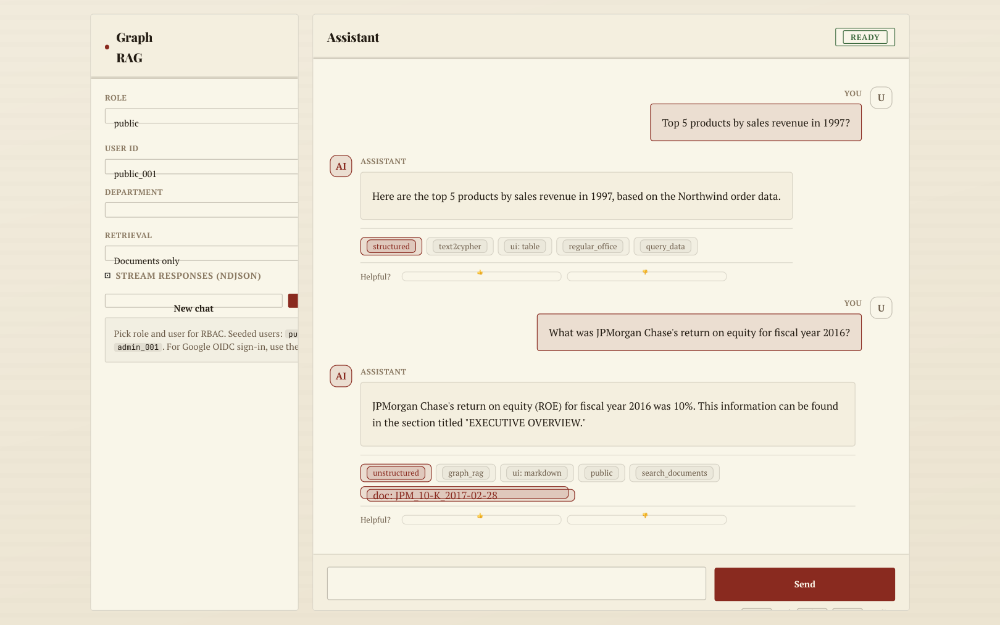
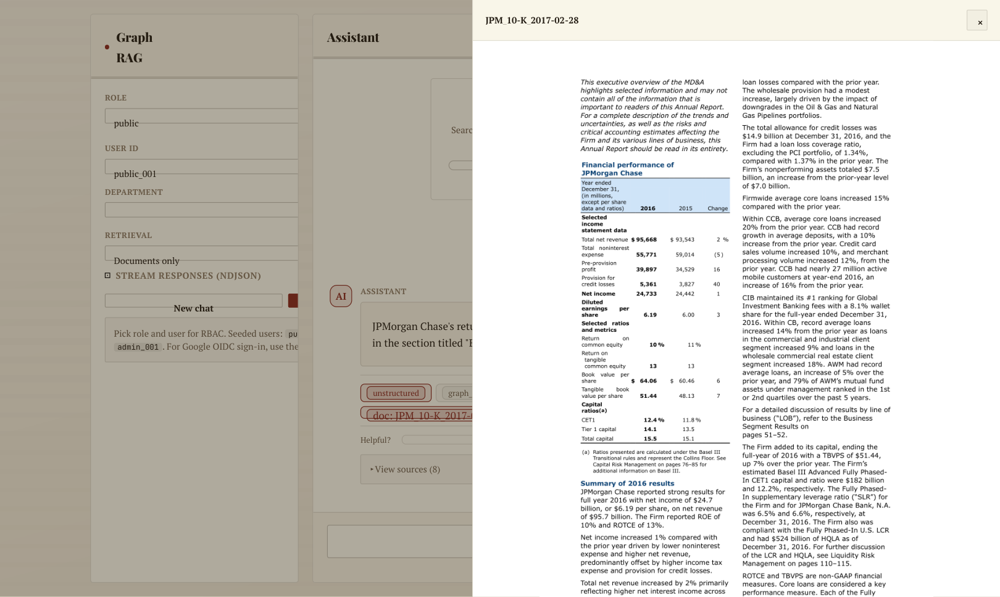
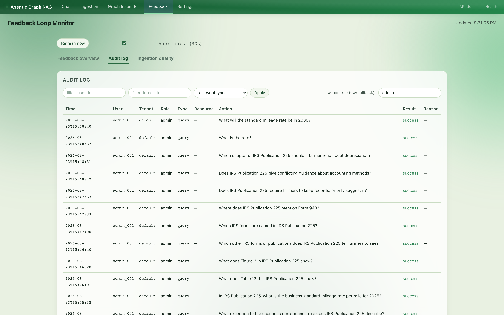
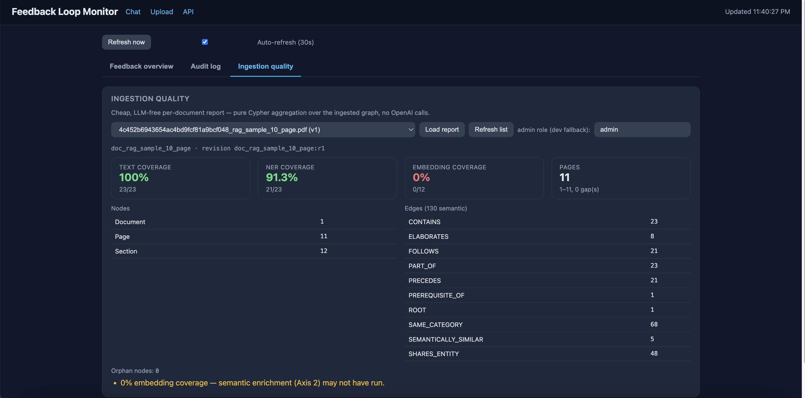
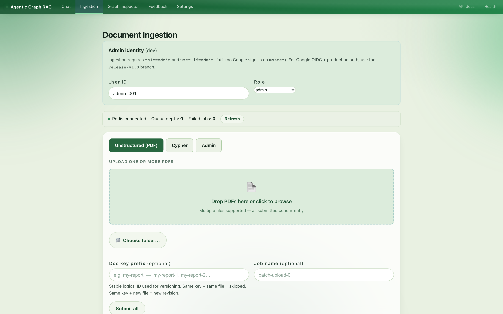
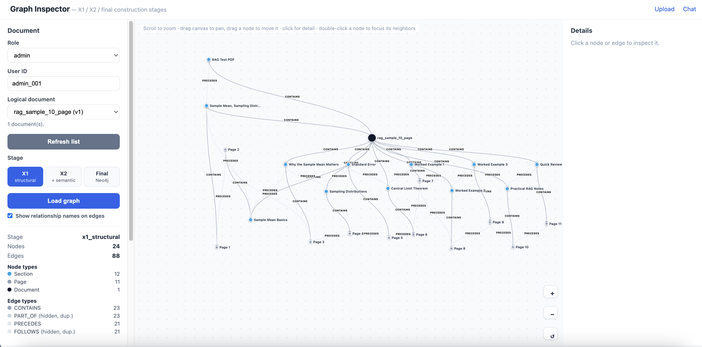
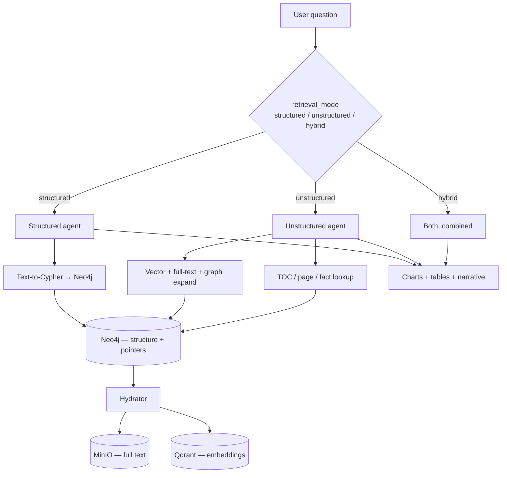

# Agentic GraphRAG

[](LICENSE)
[](#current-status)

> 🚧 **Development in progress.** Core structured + unstructured retrieval, ingestion, and the storage-split architecture below are working and covered by tests, but this is not yet a tagged release — see [Current status](#current-status) for exactly what's done vs. in flight.

## Why this is different

| Typical flat RAG                   | Agentic GraphRAG                                            |
| ---------------------------------- | ----------------------------------------------------------- |
| One chunk index for everything     | Dedicated graphs for tables vs. documents                   |
| Similarity search only             | Cypher for metrics + hybrid retrieval for PDFs              |
| Weak on counts, joins, time series | Aggregations, rankings, charts from live Neo4j              |
| Loses document structure           | Hierarchy: Document → Chapter → Section → Page → Region     |
| Guesses when context is missing    | Eval suite covers anti-hallucination and empty-result cases |

The same user session can ask _"Top 5 product categories by revenue"_ (structured) and _"Which network deployed fellows to Greece and Kosovo?"_ (unstructured, multi-hop) — you pick the source per query (**Documents** / **Structured data** tabs in the UI, `retrieval_mode` in the API), RBAC enforces who sees what, and the chat UI renders tables, charts, or narrative as appropriate.


<sub>*Conceptual illustration.* The ring is **Axis 1** — pages in reading order. The chords across the middle are **Axis 2** — semantic links between pages that are far apart structurally. Both axes live in the same graph, which is what lets a question reach a related page that keyword or page-order navigation would never surface.</sub>

**One Neo4j graph. Two knowledge modes. Structured business data and unstructured documents under the same roof — answers that flat RAG cannot reliably give.**

**Every layer is a plug-in point, not a fixed pipeline.** Parsing, ingestion, and retrieval are each built behind a real interface — `DocumentParser`, `ModelProvider`/`BlobStore`/`VectorStore`, `StructuredStrategy`/`UnstructuredStrategy` — so you can bring your own PDF parser, embedding/LLM provider, storage backend, or retrieval strategy and register it, without forking or touching existing code. Retrieval alone already ships 6 unstructured + 2 structured strategies resolved by name at runtime; parsing ships 3 (a geometry-first default with correct RTL/bidi handling and vector-rule table detection, a plain PyMuPDF/pdfplumber fallback, and a table-aware variant that fixes real over-segmentation bugs found on live SEC filings). See [Pluggable by design](#pluggable-by-design) below for the exact seams and how to add your own.

Agentic GraphRAG keeps **structured business data** and **unstructured documents** in the same graph database, with an explicit retrieval-mode switch — structured, unstructured, or hybrid — instead of an LLM guessing which one you meant. SQL-grade analytics _and_ multi-hop reasoning over PDFs/DOCX, without separate vector DBs, ETL pipelines, or ad-hoc orchestration glue, and without a misrouted question silently producing the wrong kind of answer.

It brings **your own** Neo4j schema and **your own** documents: the query router reads the live graph schema at runtime rather than hardcoding a demo domain, so it isn't tied to the bundled Olist + Go.Data sample data used below.

Built with **Neo4j · FastAPI · LangGraph**. Chat/synthesis runs on **OpenAI, Anthropic (Claude), or Gemini** — pick with `MODEL_PROVIDER`; embeddings always use OpenAI. **Cost-effective by default, not just at ingestion**: chat/synthesis defaults to a low-cost model too (`gpt-4o-mini` on the default `openai` provider, `gemini-2.5-flash` on `gemini`) — not a frontier-tier model — so running the full pipeline end to end (ingest **and** chat) doesn't require frontier-model spend. Swap to a stronger model per-provider any time via `CHAT_MODEL` if you want it.

## See it in action

**Fully transparent, audit-ready at every step — not just at the final answer.** Every ingestion is logged, every document's construction quality is a measured report (not a claim), every cited answer traces back to its real source, and every stage is a swappable plug-in rather than a black box.

<table>
<tr>
<td width="50%">

**One chat, both retrieval modes.** The same session answers a structured e-commerce query (`text2cypher` → live table) and an unstructured 10-K question (hybrid graph RAG → cited answer with a clickable source), each turn tagged with exactly which strategy, tool, and access level produced it.



</td>
<td width="50%">

**Every cited answer opens its real source.** Click a `doc:` chip and the original ingested PDF opens in a side panel, scrolled to the cited page — no separate document viewer, no re-uploading, no "trust me."



</td>
</tr>
<tr>
<td width="50%">

**Every action is audit-logged.** Who ingested what, who ran which query, who was denied access and why — filterable by user/tenant/event type, not a log file you have to grep.



</td>
<td width="50%">

**Ingestion quality is measured, not assumed.** A cheap, LLM-free per-document report — text/entity/embedding coverage, page continuity, orphan-node count — computed straight from the ingested graph for every document, so quality is a number you can check, not a hope.



</td>
</tr>
<tr>
<td width="50%">

**Drop in a PDF, get a queryable graph.** Multiple files, concurrent submission, stable logical keys for versioning — same upload path whether it's one document or a batch.



</td>
<td width="50%">

**Inspect graph construction at every pipeline stage.** Interactively explore and debug knowledge graph nodes, edge relationships, and entity schemas across structural (X1), semantic (X2), and final Neo4j stages directly in the UI.



</td>
</tr>
</table>

### Pluggable by design

Most RAG repos hardcode one parser, one embedding provider, and one retrieval path. Here every one of those is a named implementation of a real interface, resolved at runtime — not a hypothetical "you could refactor this later." These are the actual seams in the code today:

| Seam                         | Interface                                                                                                                          | Registered implementations                                                                                                                                                                                                                                                                                                          | Add your own                                                                                             |
| ---------------------------- | ---------------------------------------------------------------------------------------------------------------------------------- | ----------------------------------------------------------------------------------------------------------------------------------------------------------------------------------------------------------------------------------------------------------------------------------------------------------------------------------- | -------------------------------------------------------------------------------------------------------- |
| **Parsing**                  | `DocumentParser` Protocol — [`src/document/parser_base.py`](src/document/parser_base.py)                                           | `RtldocPdfParser` (`.pdf:rtldoc`, **default**) — geometry-first extraction via [rtldoc](https://github.com/umerjavaidkh/rtldoc), no OCR/model; `LightPdfParser` (`.pdf:light`); `TableAwarePdfParser` (`.pdf:table-aware`) — [`src/document/parser_registry.py`](src/document/parser_registry.py), switch with `PDF_PARSER_BACKEND` | Implement `parse(source) -> (nodes, edges)`, call `register_parser(".pdf:yourname", YourParser)`         |
| **Retrieval (unstructured)** | `UnstructuredStrategy` Protocol — [`src/retrieval/unstructured/strategies/base.py`](src/retrieval/unstructured/strategies/base.py) | `structural_box_list`, `subsection_tree`, `structural_toc`, `structural_page`, `structural_filing_date`, `graph_rag_hybrid`                                                                                                                                                                                                         | Implement `retrieve(...)`, call `register_unstructured("yourname", factory)`                             |
| **Retrieval (structured)**   | `StructuredStrategy` Protocol — [`src/retrieval/structured/strategies/base.py`](src/retrieval/structured/strategies/base.py)       | `text2cypher`, `multistep`                                                                                                                                                                                                                                                                                                          | Implement `retrieve(...)`, call `register_structured("yourname", factory)`                               |
| **LLM (chat/synthesis)**     | `ModelProvider` ABC — [`src/model_providers/base.py`](src/model_providers/base.py)                                                 | `OpenAIProvider`, `AnthropicProvider`, `GeminiProvider` — pick with `MODEL_PROVIDER` (`get_chat_provider()` in [`src/model_providers/factory.py`](src/model_providers/factory.py))                                                                                                                                                  | Implement `chat_completion`/`chat_completion_stream`, register in `get_model_provider()`                 |
| **Embeddings**               | same `ModelProvider` ABC                                                                                                           | `OpenAIProvider` only — always used regardless of `MODEL_PROVIDER` (Anthropic has no embeddings API; Qdrant's collection has a fixed dimension) — see `get_embedding_provider()`                                                                                                                                                    | Swapping embedding provider/dimension needs a matching Qdrant collection rebuild; not currently wired up |
| **Blob storage**             | `BlobStore` ABC — [`src/storage/blob/base.py`](src/storage/blob/base.py)                                                           | Local filesystem, MinIO                                                                                                                                                                                                                                                                                                             | Implement `put`/`get`/`delete`/`exists`, wire into `get_blob_store()`                                    |
| **Vector storage**           | `VectorStore` ABC — [`src/storage/vector/base.py`](src/storage/vector/base.py)                                                     | In-memory, Qdrant                                                                                                                                                                                                                                                                                                                   | Implement `upsert`/`query`/`delete`, wire into `get_vector_store()`                                      |

Two consequences worth calling out:

- **Parsing bugs get fixed as new strategies, not patches on the default.** `TableAwarePdfParser` was added after real ingestion-quality regressions surfaced on live SEC filings (table rows misread as headings, repeated running headers counted as chapters) — it's a second, independently-selectable implementation (`PDF_PARSER_BACKEND=table-aware`), A/B-compared against the default on the same documents before being trusted, not a silent behavior change to everyone's pipeline.
- **Ingestion quality is measured, not assumed.** [`scripts/validate_ingestion.py`](scripts/validate_ingestion.py) and `GET /ingest/quality/{doc_id}` compute a cheap, LLM-free per-document report (text/NER/embedding coverage, orphan nodes, page continuity) straight from the ingested graph — the same tool that caught the regressions above, and how any new parser/provider gets evaluated before it's recommended.
- **Schema-driven, not domain-hardcoded.** The query router reads the live Neo4j schema (`structured_entity_summary()`) at runtime instead of hardcoding a demo domain — bring your own graph and the routing adapts.
- **LLMs are optional at ingestion, not required.** Parsing and structural graph construction (Document → Chapter → Section → Page → Region, all edges) are pure PDF-geometry heuristics — zero LLM calls, works with no API key at all. An LLM is only used for the _semantic_ enrichment layer on top (entity extraction, `SHARES_ENTITY`/`SAME_CATEGORY` linking, optional `CONTRADICTS`/`ELABORATES` reasoning, chapter summaries) — and it degrades gracefully (structural graph still gets built, semantic step just gets skipped) if no chat-provider key is configured. When it does run, it defaults to a low-cost model (`gpt-4o-mini`, configurable via `AXIS2_MODEL`), not a frontier-tier model — ingesting a large corpus doesn't require frontier-model spend.

## Architecture


```mermaid
flowchart TB
  Q[User question] --> M{retrieval_mode\nstructured / unstructured / hybrid}
  M -->|structured| S[Structured agent]
  M -->|unstructured| U[Unstructured agent]
  M -->|hybrid| H[Both, combined]
  S --> C[Text-to-Cypher → Neo4j]
  U --> V[Vector + full-text + graph expand]
  U --> T[TOC / page / fact lookup]
  C --> N[(Neo4j — structure + pointers)]
  V --> N
  T --> N
  N --> HY[Hydrator]
  HY --> B[(MinIO — full text)]
  HY --> QD[(Qdrant — embeddings)]
  S --> UI[Charts + tables + narrative]
  U --> UI
  H --> UI
```

The mode is set explicitly per query — by the caller (the **Documents** / **Structured data** tabs in the UI, or the API's `retrieval_mode` field), not inferred by an LLM — so a question can't silently get routed to the wrong knowledge source.

The selected source is also the *only* source consulted. Structured and document retrieval each used to fall back to the other on a weak or empty result, which meant a question asked of the business data could come back as "this document does not cover it" — naming the wrong corpus, with no sign the other source had been searched. That crossover is now blocked (`routing.enforce_mode`).

**Neo4j is a lean skeleton, not the content store.** For unstructured documents, Neo4j holds structure only — nodes (Document → Chapter → Section → Page → Region), `CONTAINS`/`PRECEDES` edges, titles, page numbers, entities, and a capped `search_text` snippet per node for lexical/graph matching. The **full page/section text lives in MinIO**, and **embeddings live in Qdrant** — Neo4j never stores either directly. Retrieval still runs entirely as Neo4j graph queries (vector seed lookup, full-text, graph expansion); only the final step — handing text to the LLM as context — goes through a `Hydrator` seam that resolves a node's blob pointer back to its full text (with a bounded in-process cache for repeat lookups within a query). This keeps the graph small and fast to query at scale while text/vectors live in stores built for them.

Full write-up (query path, ingestion pipeline, multi-tenancy, audit log, project structure): **[docs/ARCHITECTURE.md](docs/ARCHITECTURE.md)**.

## Quick start

```bash
git clone https://github.com/umerjavaidkh/agentic_graph_rag.git
cd agentic_graph_rag
cp .env.example .env          # add OPENAI_API_KEY (always required — embeddings)
# Optional: MODEL_PROVIDER=anthropic|gemini for chat/synthesis + the matching
# ANTHROPIC_API_KEY/GOOGLE_API_KEY — defaults to openai for chat too if unset.
docker compose up --build
```

| Page                         | URL                            |
| ---------------------------- | ------------------------------ |
| **Chat**                     | http://localhost:8000/chat     |
| **Upload**                   | http://localhost:8000/upload   |
| **Feedback + audit monitor** | http://localhost:8000/feedback |
| **API docs**                 | http://localhost:8000/docs     |
| **Health**                   | http://localhost:8000/health   |

> Do **not** set `NEO4J_URI` in `.env` when using the bundled Docker Neo4j — it is wired automatically.

Try it in `/chat` with the dev sidebar (`master` branch, no sign-in required):

| Track                                      | User ID          | Role                 | Try asking                                                |
| ------------------------------------------ | ---------------- | -------------------- | --------------------------------------------------------- |
| Structured (needs Olist sample loaded)     | `regular_001`    | `regular_office`     | _What are the top 5 product categories by total revenue?_ |
| Unstructured (needs a PDF ingested)        | `public_001`     | `public`             | _List the table of contents from the document._           |
| Hybrid                                     | `compliance_001` | `compliance_officer` | _Show compliance incidents and summarize related policy._ |
| Ingestion                                  | `admin_001`      | `admin`              | use `/upload`                                             |

Load the sample data:

- **Documents** — drag a PDF from `sample_data_to_test/unstructured/` onto `/upload`.
- **Structured** — a 4,000-order Olist e-commerce sample is **bundled in the repo**, so
  there is no download and no Kaggle account needed:

  ```bash
  python scripts/load_olist.py --source sample_data_to_test/structured/olist-sample
  ```

  For the full ~100k-order dataset (550k nodes), download it from
  [Kaggle](https://www.kaggle.com/datasets/olistbr/brazilian-ecommerce) and point
  `--source` at the unzipped directory. The sample is a referentially complete slice —
  see [ATTRIBUTION.md](sample_data_to_test/structured/olist-sample/ATTRIBUTION.md) for
  how it was cut and for its licence, which is **CC BY-NC-SA, not MIT like the code**.

- **Your own tables** — CSV directory, Excel workbook, or SQLite file. Prints the schema and relationships it inferred and stops, so you can check the plan before anything is written:

  ```bash
  python scripts/load_tabular.py --source ./my-data      # dry run
  python scripts/load_tabular.py --source ./my-data --load
  ```

Nodes carry the source they were loaded from, so `--clear` only removes rows that loader wrote and leaves other datasets in the same graph alone.

A Northwind dump is still present at `sample_data_to_test/structured/northwind-data.cypher` (upload with `ALLOW_CYPHER_INGEST=true`), but the examples, eval and docs target Olist.

## Dataset migration: Olist (in progress)

The bundled structured dataset changed from Northwind to the
[Olist Brazilian e-commerce](https://www.kaggle.com/datasets/olistbr/brazilian-ecommerce)
data — **552,299 nodes, 99,441 orders**, roughly 100× the old sample. Swapping it
exposed a class of bug that a small demo schema had been hiding, because a query
written against the wrong field returns *a number* rather than an error.

### What is better now

Swapping a ~5k-row demo schema for 552k nodes of real data is what exposed these.
Each one returned a plausible number rather than an error, which is why a small
dataset had hidden every one of them.

| Was | Now |
| --- | --- |
| Total freight reported as **"zero"** — the generated Cypher read a node property off a relationship, and Neo4j returns null rather than erroring | **2,251,910**, the true value. Property references are validated against the live schema before execution |
| "Average salary of employees" answered **1,786,771,191,163** — `avg(created_at)` aliased as `averageSalary` | States the data does not contain it |
| "Cost of goods sold" answered with the **sum of product weight in grams** | Refuses. A single-row aggregate is checked against the question before it is returned — the shape every fabrication took |
| **99,441 customers who each bought exactly once** — the loader made a node per order, so every retention answer was wrong and none looked wrong | **96,096 people, 3.12% repeat rate.** Keyed on the person, not the per-order id |
| "How many orders were cancelled?" → **"there were no orders cancelled"** against 625 | **625.** The schema now lists every value of a low-cardinality property, so `canceled` is visible rather than sampled past |
| Averages silently truncated — 1.14 items per order returned as **1** | **1.14.** `round(avg(x))` goes to zero decimals in Neo4j; repaired to two |
| Document queries took **165s** at this scale, and the UI never returned | **8s** |
| Choosing "Structured data" could still answer from documents | The selected source is the only one consulted |

**The 100-question business eval went 79 → 94.** It is deterministic — ground truth
is computed from the graph by hand-written Cypher, with no LLM judge — so it costs
nothing to run and gives the same answer twice. That matters: the sampled-judge
score this project used to steer by swung **63 to 80 on an identical graph**, and
would have scored the freight-of-zero bug as fine.

### Still in progress

Named specifically, because a number without its failures is not a measurement.

- **6 of the 100 business questions still fail**, each recorded with its generated
  Cypher in `eval/baseline_olist_business.json`: a join that walks out of `Payment`
  into a different `Order` (returning 1.0 for an average review score), an `avg()`
  taken over rows already collapsed one-per-seller, prose that drops the seller id
  the query did return, and two absence questions still answered intermittently.
- **Model choice is the limit on most of those.** Measured on the same cases,
  `gpt-4.1-mini` gets seven wrong that `gpt-4.1` answers correctly. The larger model
  is currently used only to regenerate after a failure
  (`STRUCTURED_FALLBACK_MODEL`), which cannot help a query that succeeds with the
  wrong answer.
- **Two LLM-judge suites (20 cases) still target Northwind**, so the previously
  reported 95/101 is stale rather than re-measured.
- **Category names are Portuguese.** Asking for an English category (`bed_bath_table`)
  filters `Category.name`, which holds `cama_mesa_banho`.
- **Olist products are anonymised** — no name column exists, so product answers can
  only cite an id and category.
- **The document half has no equivalent suite.** These 100 questions cover structured
  retrieval only.

## How it scales

Stated from the code rather than intent, because the two get confused easily.

**Neo4j holds structure, not bulk.** `Neo4jExporter._node_to_param_dict` deliberately
omits the full `text` body; nodes keep `search_text` (chunk-bounded, for lexical
matching) plus `blob_key_text` / `vector_id` pointers. `_dual_write_chunk` writes the
body to the blob store and the embedding to the vector store, and `Hydrator` fetches
text back on the read path. Graph size therefore tracks **node and edge count**, not
corpus bytes.

**Axis-2 edge count is linear, not quadratic.** `_topk_edge_pairs` caps each node's
degree via `_cap_edges_by_degree` (`AXIS2_MAX_SIMILARITY_EDGES_PER_NODE`, default 20),
so edges grow as O(nodes × k). An earlier build used a flat similarity threshold with
no per-node cap, which is what let a 7,165-node document emit 2.17M edges; that is
fixed, and the cap is what makes corpus growth safe.

**Axis-2 and chapter summaries run per document.** `GraphConstructionService` builds
Axis-2 over one document's node list per ingestion job, so a corpus of N documents is N
independent bounded builds — embarrassingly parallel, linear in N. The similarity matrix
is O(n²) *within* a document, so the size that matters is the largest single document,
not the size of the corpus.

**Chapter summaries instead of community detection.** Ingested documents already carry
author-provided structure, so `ChapterSummaryBuilder` summarises each Chapter from its
own sections rather than discovering communities with Leiden — one bounded LLM call per
chapter, no extra graph-algorithm dependency.

### Known limits

- **Both graphs share one Neo4j instance.** Business nodes and the document tree are
  peers, and they interfere: loading 550k business nodes made an unlabelled document
  query scan the whole store (155s, since fixed), and the structured metric picker had
  to be taught to ignore document labels or it offered `Chapter.order` as a meaning of
  "order" (`NON_BUSINESS_LABELS`).
- **No cross-document semantic edges.** Because Axis-2 is per document, similarity links
  and summaries never span documents. Corpus-level questions ("what themes recur across
  these 500 filings") are not served by the graph today.
- **Per-document ingestion cost.** Embeddings and NER run per document; throughput and
  provider quotas, not graph size, are the practical ceiling on a large corpus.

## Tech stack

| Layer                                       | Technology                                                                     |
| ------------------------------------------- | ------------------------------------------------------------------------------ |
| Graph database                              | Neo4j 5.x                                                                      |
| AI orchestration                            | LangGraph                                                                      |
| API                                         | FastAPI + Uvicorn                                                              |
| LLM (chat/synthesis, optional at ingestion) | OpenAI, Anthropic, or Gemini (`MODEL_PROVIDER`; default gpt-4o-mini, low-cost) |
| Embeddings                                  | OpenAI only, always (text-embedding-3-small)                                   |
| PDF parsing                                 | PyMuPDF + pdfplumber                                                           |
| Full-text storage (unstructured docs)       | MinIO (blob store), pointed to from lean Neo4j nodes                           |
| Vector storage                              | Qdrant, authoritative for embeddings                                           |
| Job queue                                   | Redis + RQ _(optional — in-process fallback when unset)_                       |
| Containers                                  | Docker / Docker Compose                                                        |

## Current status

| Area                                                                                                                                                                                          | Status                                                                                                   |
| --------------------------------------------------------------------------------------------------------------------------------------------------------------------------------------------- | -------------------------------------------------------------------------------------------------------- |
| Dual-graph RAG (structured + documents + hybrid) via explicit retrieval-mode selection                                                                                                        | ✅                                                                                                       |
| Olist e-commerce sample replacing Northwind — 552k nodes, schema-agnostic structured path (see [Dataset migration](#dataset-migration-olist-in-progress))                    | 🚧 in progress — data loaded and retrieval migrated; two LLM-judge eval suites still target the old schema |
| Pluggable parser / retrieval strategy registries (see [Pluggable by design](#pluggable-by-design))                                                                                            | ✅                                                                                                       |
| Multi-provider chat/synthesis (OpenAI, Anthropic, Gemini) — embeddings always OpenAI                                                                                                          | ✅                                                                                                       |
| Scalable ingestion (Redis + RQ workers, versioning)                                                                                                                                           | ✅                                                                                                       |
| Ingestion-quality validation (`GET /ingest/quality`, LLM-free per-document report)                                                                                                            | ✅                                                                                                       |
| Source document viewer — click a citation, view the original PDF in a side panel                                                                                                              | ✅                                                                                                       |
| Bulk-question queue — paste several questions, answered one at a time in order                                                                                                                | ✅                                                                                                       |
| Multi-tenancy (property-based `tenant_id` isolation)                                                                                                                                          | ✅                                                                                                       |
| Audit log (who / what / when / result, admin API + dashboard)                                                                                                                                 | ✅                                                                                                       |
| Google OIDC auth, RBAC, per-user thread isolation                                                                                                                                             | ✅ (`release/v1.0`)                                                                                      |
| Streaming answers with charts, retrieval feedback loop                                                                                                                                        | ✅                                                                                                       |
| Fast deterministic eval — 12 cases across fact / aggregate / ranking / multihop / temporal / absence (`scripts/eval_structured.py`) | ✅ 11/12 — the quick tier, run during iteration |
| **Business-question eval — 100 questions a business user would actually ask** (delivery performance, satisfaction drivers, seller concentration, retention, payment mix, and absence), each with ground truth computed from the graph by hand-written Cypher (`eval/olist_business_suite.json`) | ✅ **94/100** — deterministic, no LLM judge, free to run. Every remaining failure is named in `eval/baseline_olist_business.json` |
| LLM-judge eval suites — 4 suites, 101 cases (structured, advanced multi-hop structured, ingested documents incl. multi-turn continuity, SEC 10-K/10-Q filings incl. cross-document) | ⚠️ last measured 95/101 against the Northwind sample; the two structured suites still target that schema and have not been re-pointed at Olist, so those numbers are stale |
| Storage split — lean Neo4j (structure, `search_text` and pointers only), full text in a blob store, embeddings in a vector store, `Hydrator` seam on the read path        | ✅ write-side strip and dual-write are in place and tested; `BLOB_STORE_BACKEND` / `VECTOR_STORE_BACKEND` still default to `local` / `memory`, so MinIO + Qdrant are opt-in |
| Axis-2 semantic-edge precision (target ≥90% via sampled LLM-judge)                                                                                                                            | 🚧 in progress — structural graph (Axis-1) already scores ~99-100%, semantic linking is the open gap     |
| 1000-document corpus validation, then a tagged release                                                                                                                                        | 🚧 in progress                                                                                           |
| CI (tests on push/PR)                                                                                                                                                                         | 🚧 in progress                                                                                           |

**Roadmap:** validate ingestion + retrieval quality across a 1000-document real-world corpus before cutting a tagged release; per-user short/long memory across threads; multi-language query & answer support; Kubernetes/Terraform deployment reference.

## Documentation

| Doc                                                                                  | Covers                                                                                                                                                                                                            |
| ------------------------------------------------------------------------------------ | ----------------------------------------------------------------------------------------------------------------------------------------------------------------------------------------------------------------- |
| [docs/ARCHITECTURE.md](docs/ARCHITECTURE.md)                                         | Query path, ingestion pipeline, multi-tenancy, audit log, project layout                                                                                                                                          |
| [docs/INGESTION_RETRIEVAL_ARCHITECTURE.md](docs/INGESTION_RETRIEVAL_ARCHITECTURE.md) | Deep dive: how parsing, ingestion enrichment, and retrieval strategies are loosely coupled — diagrams for the parser registry, full ingestion pipeline, retrieval strategy dispatch, and the extension points map |
| [docs/CONFIGURATION.md](docs/CONFIGURATION.md)                                       | Every environment variable, feedback loop workflow                                                                                                                                                                |
| [docs/AUTHENTICATION.md](docs/AUTHENTICATION.md)                                     | Auth branches, RBAC, seeded demo users, identity flow                                                                                                                                                             |
| [docs/API.md](docs/API.md)                                                           | curl reference for every endpoint                                                                                                                                                                                 |
| [docs/TROUBLESHOOTING.md](docs/TROUBLESHOOTING.md)                                   | Common setup issues, local dev without Docker                                                                                                                                                                     |

Medium article: [Agentic Graph RAG — architecture and walkthrough](https://medium.com/p/0ee1f6baae26)

## Security

- Never commit `.env` — it is gitignored.
- Production checklist: `AUTH_ENABLED=true`, `AUTH_ALLOW_BODY_FALLBACK=false`, restrict `AUTH_EMAIL_ROLE_MAP` to real admins, `ALLOW_CYPHER_INGEST=false`, `ALLOW_DB_RESET=false`, don't expose Neo4j (17474/17687) or Redis (6379) publicly.
- Ingest and admin routes require a verified Google JWT + `admin` role — never trust form `role`/`user_id`.
- Every query, access denial, and ingestion submission is recorded in the audit log (`AUDIT_LOG_ENABLED=true` by default).

Full checklist: [docs/AUTHENTICATION.md](docs/AUTHENTICATION.md).

## Contributing

Issues and PRs welcome. Run `pytest tests/` before submitting — CI to enforce this automatically is on the way.

## License

[MIT](LICENSE) — use it, fork it, ship it commercially, just keep the copyright notice.
