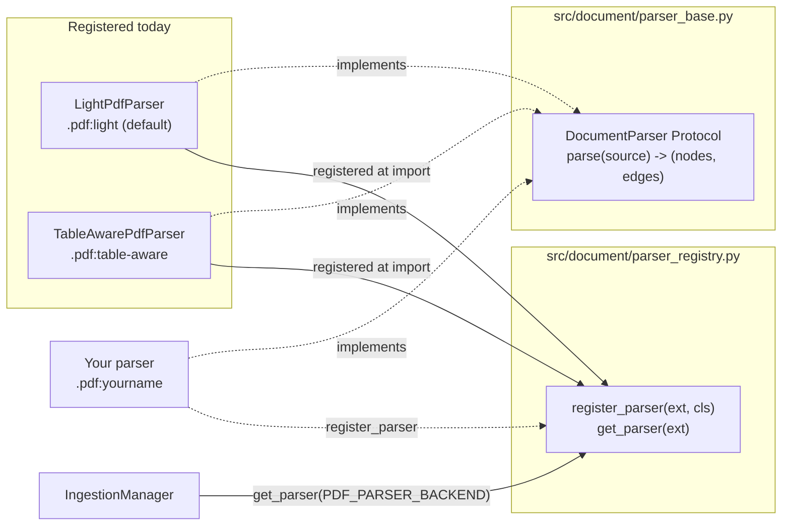
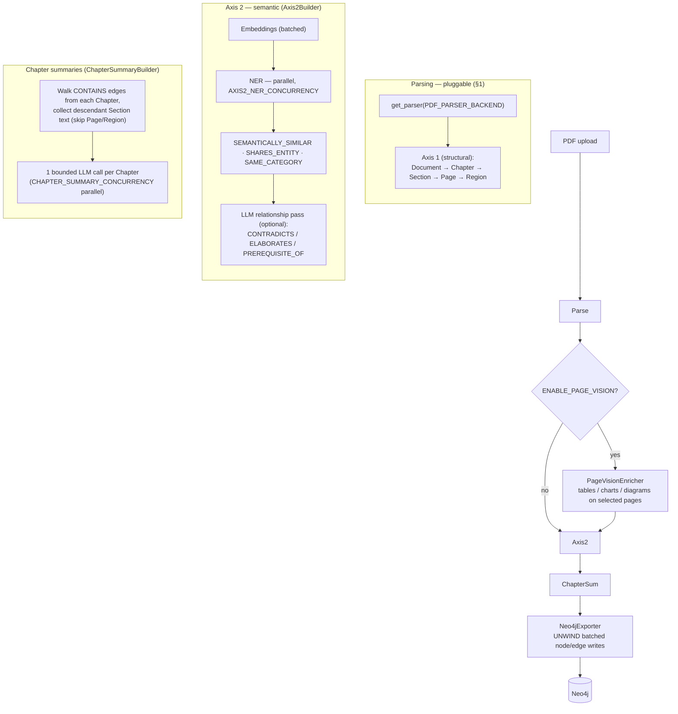
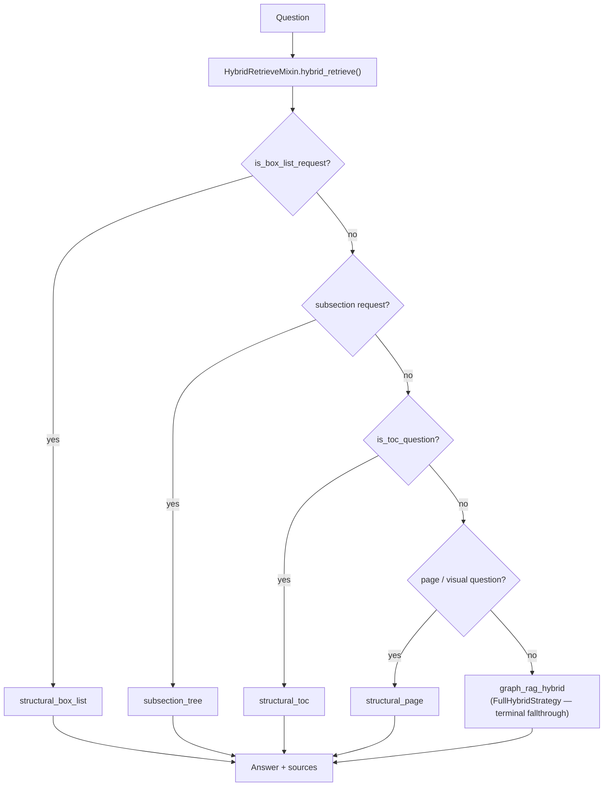
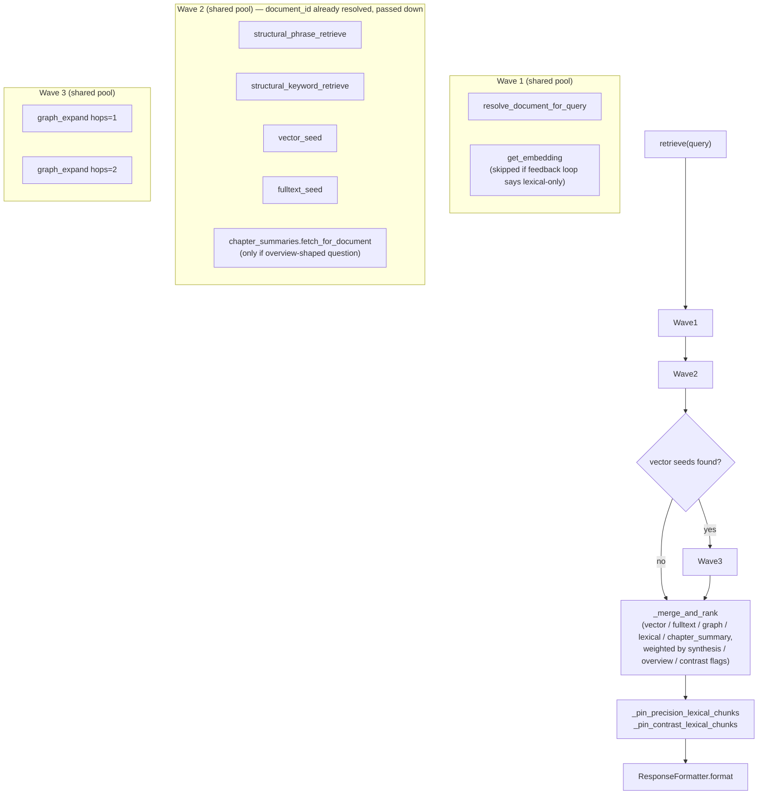
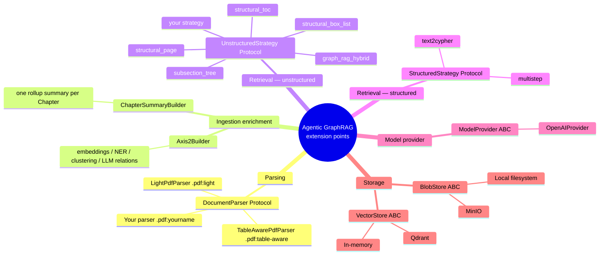

# Ingestion & Retrieval: how the pieces stay loosely coupled

This is a deeper companion to the [README's "Pluggable by design" table](../README.md#pluggable-by-design) and [ARCHITECTURE.md](ARCHITECTURE.md) — it walks through *how* parsing, ingestion enrichment, and retrieval actually stay decoupled in this codebase, with diagrams for each seam, and closes with a real worked example (not a hypothetical) of what changes when a new capability is added.

## 1. Parsing: extension-keyed registry, not an if/elif chain

Every parser implements one Protocol and registers itself under a file-extension key. `IngestionManager` never imports a concrete parser class — it asks the registry for whatever is configured.

`TableAwarePdfParser` is the concrete proof this works: it was added *after* real ingestion-quality regressions surfaced on live SEC filings (table rows misread as headings, repeated running headers counted as chapters). It exists as a second, independently-selectable implementation — nothing in `LightPdfParser` changed, nothing in `IngestionManager` changed, no caller needed to know a second parser now exists.

## 2. The full ingestion pipeline

Every enrichment stage after structural parsing operates on the same in-memory `list[DKGNode]` / `list[DKGEdge]` — each stage reads what it needs, mutates or appends, and hands the list to the next stage. None of them talk to Neo4j directly; the exporter is the only stage that does, at the very end.

Both semantic passes are best-effort and independently disable-able (`OPENAI_API_KEY` unset skips both; each wraps its own LLM calls in try/except so one failed summary or NER call never fails the ingestion job) — see the `chapter_summarization` / `semantic_enrichment` statuses in `IngestionStatus`.

## 3. Retrieval: strategy registry + question-shape dispatch

`src/retrieval/strategy_registry.py` is a flat, name-keyed registry shared by both the structured and unstructured sides — mirroring the parser registry's pattern exactly. `HybridRetrieveMixin.hybrid_retrieve()` checks question shape (not keywords hardcoded per-domain) to pick a strategy, falling through to the terminal hybrid strategy when nothing more specific matches.

Each box in that chart is one class implementing `UnstructuredStrategy.retrieve(...)` — see [ARCHITECTURE.md's registry table](ARCHITECTURE.md#retrieval-strategies-registry-pattern) for the exact file per strategy. Adding a new one means writing the class and calling `register_unstructured("yourname", factory)` in `strategies/registration.py` — no change to `hybrid_retrieve()` or any existing strategy, unless the new strategy also needs its own question-shape check to be reached before the terminal fallthrough.

## 4. Inside the terminal strategy: the concurrent fan-out

`FullHybridStrategy` — the fallthrough every non-structural question eventually reaches if nothing more specific matched — fans out to every retrieval channel concurrently on one shared, process-wide thread pool (not per-request pools; Neo4j sessions aren't thread-safe, so each concurrent task opens its own session via `_neo4j_session_call`).

`document_id` is resolved exactly once per query (Wave 1) and threaded into every downstream fetch that needs it — the phrase/keyword lexical calls used to each re-resolve it independently inside their own already-open session, a fully redundant round trip fixed in this same pass.

## 5. Extension points, all in one map

## 6. Worked example: adding chapter-summary rollups

Rather than describe loose coupling abstractly, here's what actually changed to add the whole feature diagrammed in §2 and §4 (Section 5's "ChapterSummaryBuilder" / chapter-summary fan-out branch) — a real capability, not a toy example:

**Files touched (12, none of them a rewrite):**

| File | Change |
|------|--------|
| `src/models.py` | +1 field on `DKGNode` (`summary`) |
| `src/exporter/exporter.py` | +1 dict key in the batched-write param mapper, +1 SET clause in the legacy per-node writer |
| `src/ingestion/models.py` | +1 `IngestionStatus` enum value |
| `src/config/settings.py` | +1 settings block (model, concurrency, context-size caps) |
| `src/prompts/chapter_summary.txt` | new prompt file |
| `src/semantic/chapter_summary.py` | **new** — `ChapterSummaryBuilder`, mirrors `Axis2Builder`'s shape |
| `src/ingestion/service.py` | +1 call site after the existing Axis 2 call |
| `src/retrieval/unstructured/services/chapter_summary.py` | **new** — `ChapterSummaryService`, mirrors `LexicalService`'s shape |
| `src/retrieval/unstructured/services/ranking.py` | +1 parameter, +1 weighting block in `_merge_and_rank` |
| `src/retrieval/unstructured/strategies/registration.py` | +1 service constructed, passed into `FullHybridStrategy` |
| `src/retrieval/unstructured/strategies/full_hybrid.py` | +1 conditional fetch, wired into the existing merge call |
| `src/retrieval/unstructured/query_intent.py` | +1 question-shape detector (`is_overview_question`) |

**Files *not* touched:** `TocStrategy`, `PageStrategy`, `BoxStrategy`, `SubsectionStrategy`, both structured strategies, `LightPdfParser`, `TableAwarePdfParser`, `Axis2Builder`, and every other retrieval/ingestion component not directly in this feature's path. Zero of them needed to know a new enrichment stage or candidate source now exists.

That's the concrete claim behind "pluggable by design": a new ingestion enrichment stage *and* a new retrieval candidate source, wired end-to-end, without modifying any existing strategy or parser — only adding to the registries and services that were already built to be extended.
